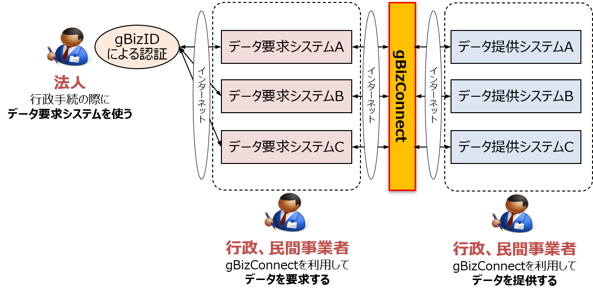
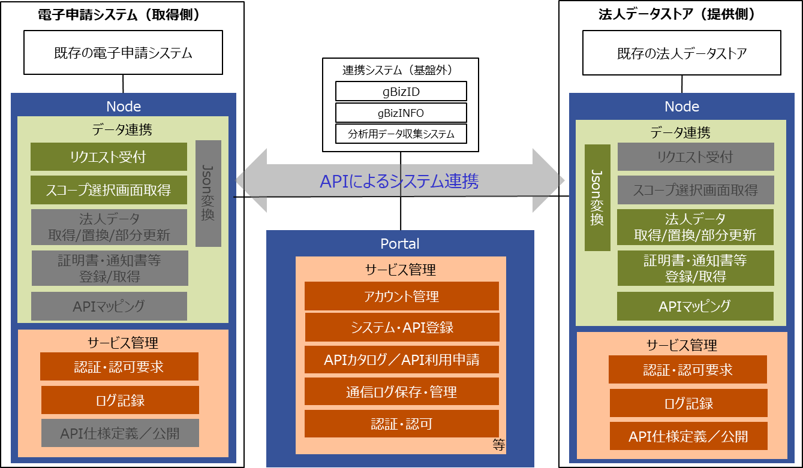
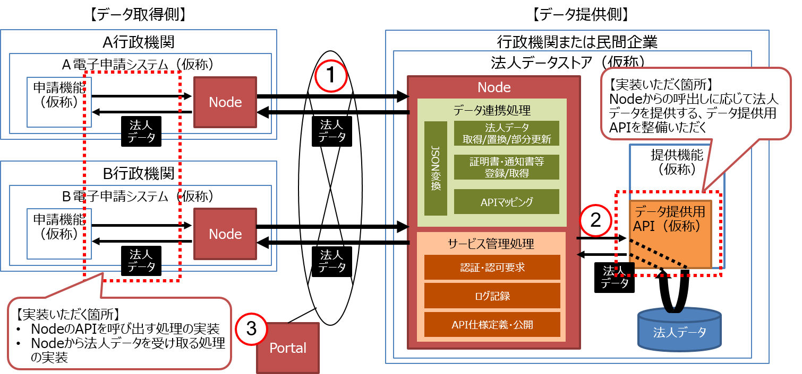

# お知らせ
2021年09月01日
デジタル庁設置に伴い、本プラットフォームを経済産業省からデジタル庁へ移管しました。
ドメイン名やサーバー証明書の名義等が当面の間、旧所管府省名となっておりますが、システムを御利用いただくに当たって支障はございません。

# **gBizConnectについて**

## プロダクトのコンセプト  
* gBizConnect(法人データ連携基盤)とは、法人向け行政手続における添付書類撤廃・ワンスオンリーのための基盤として、官民が保有する法人情報を閲覧・取得して申請処理等に活用する仕組みを提供します。

  

## プロダクト概要  
* gBizConnectは、法人データを利用して手続きの申請処理等を行うデータ要求システムと、 法人データを蓄積しデータ要求システムへ法人データを提供するデータ提供システムの間で、インターネットを介してAPIによるシステム連携を行う仕組みです。
* システム連携を行うデータ要求システムとデータ提供システムの開発・運用の負担を軽減するため、データ連携処理や認証・認可、ログ記録等の共通機能をパッケージングしたgBizConnect Nodeを、システム連携を行うそれぞれのシステムに配布・配置することで動作します。
* また、データ要求システム及びデータ提供システムの開発者に対して情報提供や支援を行うポータルや、API・データの仕様を参照することができるカタログ、認証・認可やgBizConnectへの参加システムを管理するシステム・サービス管理等の共通的な機能等をgBizConnect Portalにて提供します。

  

## gBizConnect利用のメリット  

gBizConnectを利用することで、次のメリットがもたらされます。

* 手続きコストの削減

　　特定の行政手続きを行った後に、申請した申請内容を別の行政手続きで、参照取得することができます。（ワンスオンリー）

* システム開発コストの削減

　　データ連携に必要な機能(アクセス管理、流量制御、ログ集約・可視化、利用状況管理)を共通化することにより、個々のシステムの機能開発負荷を軽減できます。

* データ利活用の容易性

　　データを法人標準データの形式で取得可能とすることで、データ品質を一定化することができます。

gBizConnectを利用するシステムが増えるほど、これらのメリットの効果を上げることができます。

    

## 環境構築  
以下のドキュメントを参照してください。
* [gBizConnect Node導入マニュアル](docs/gBizConnectNode_Manual.md)  
* [gBizConnect Node仕様書](docs/gBizConnectNode.md)  

## gBizConnect Node APIの実装に使用している主なライブラリ等
* OpenID Connectの認可コードフローの処理に下記URLのライブラリとその依存ライブラリを使用しています。  
https://github.com/zmartzone/lua-resty-openidc

* OAuth 2.0 Token Introspectionの処理は下記URLのソースを基にしています。  
https://github.com/nginxinc/NGINX-Demos/tree/master/oauth2-token-introspection-oss

* docker-edge-moduleのDockerfileは下記URLのDockerfileを基にnjsとLuaライブラリを追加しています。  
https://github.com/ilagnev/docker-alpine-nginx-lua

## gBizConnect関連資料
  * [gBizConnect ガイドライン](docs/gBizConnect_guidelines.pdf)
  * [gBizConnect 利用規約](docs/gBizConnect_Riyoukiyaku.pdf)  
  * [gBizConnect 利用者情報取扱方針](docs/gBizConnect_privacy.pdf)
  * [gBizConnect セキュリティ管理方針](docs/gBizConnect_security.pdf)
  * [gBizConnect よくあるお問い合わせ](docs/gBizConnect_faq.pdf)

 ### gBizConnect Node

  * [gBizConnect Node導入マニュアル](docs/gBizConnectNode_Manual.md)  
  * [gBizConnect Node仕様書](docs/gBizConnectNode.md)  

 ### gBizConnect Portal
  * [gBizconenct Portal サービス仕様書](docs/gBizConnectPortal_service.pdf)

 ## gBizConnectと関連のあるシステム  
 * [gBizID](https://gbiz-id.go.jp/top/)

 ## プロダクトロゴ  
 gBizConnectでは下記のロゴを使用します。 
 
   

 ## ライセンス  
 本ソフトウェアは、[MITライセンス](LICENSE)の元提供されています。

 ## 使用しているソフトウェアについて
使用しているソフトウェアのライセンスについては以下のドキュメントを参照してください。
* [included_licenses](docs/included_licenses.md)
