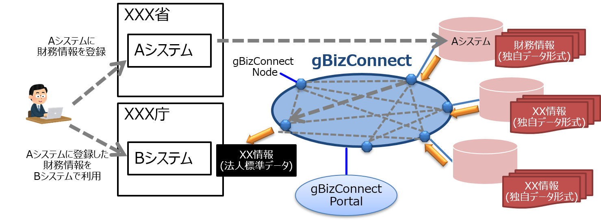

# **gBizConnect**

## プロジェクト概要  
* gBizConnectは、法人データを利用して実際の業務処理を行う電子申請システムと、 法人データを蓄積し電子申請システムへ法人データを提供する法人データストアの間で、インターネットを介してAPIによるシステム連携を行う仕組みです。
* システム連携を行う電子申請システムと法人データストアの開発・運用の負担を軽減するため、データ連携処理や認証・認可、ログ記録等の共通機能をパッケージングしたgBizConnect Nodeを、システム連携を行うそれぞれのシステムに配布・配置することを想定しています。
* また、電子申請システム及び法人データストアの開発者に対して情報提供や支援を行うポータルや、API・データの仕様を参照することができるカタログ、認証・認可やgBizConnectへの参加システムを管理するシステム・サービス管理等の共通的な機能等をgBizConnect Portalにて提供します。

  

## プロジェクトロゴ  
gBizConnectでは下記のロゴを使用します。 

  

## ライセンス  
本ソフトウェアは、[MITライセンス](LICENSE)の元提供されています。

## 環境構築  
以下のドキュメントを参照してください。
* [gBizConnect Node導入マニュアル](docs/gBizConnectNode_Manual.md)  
* [gBizConnect Node仕様書](docs/gBizConnectNode.md)  

## 使用言語  
* njs
* Lua
* PHP

## gBizConnect Node APIの実装に使用している主なライブラリ等
* OpenID Connectの認可コードフローの処理に下記URLのライブラリとその依存ライブラリを使用しています。  
https://github.com/zmartzone/lua-resty-openidc

* OAuth 2.0 Token Introspectionの処理は下記URLのソースを基にしています。  
https://github.com/nginxinc/NGINX-Demos/tree/master/oauth2-token-introspection-oss

* docker-edge-moduleのDockerfileは下記URLのDockerfileを基にnjsとLuaライブラリを追加しています。  
https://github.com/ilagnev/docker-alpine-nginx-lua

## gBizConnect接続のメリット  
* システム視点でのメリット例と活用イメージは以下の通りです。  
１．他システム間連携を簡易に実現（個別のIF調整や認証認可に係る処理実装等が必要ない）  
２．他システム間連携におけるテスト工数の縮小化（システム間はgBizConnect側で行うため、テスト範囲はNodeと内部システム間の連携部分のみ）  
３．認可に係る手続の簡略化（gBizConnect Portalの画面操作で手続が可能）

    

## gBizConnect関連資料
 * [紹介資料](docs/gBizConnectIntroduction.pdf)  
 * [利用規約](docs/Riyoukiyaku.md)  
 * [gBizConnect Portal利用者向けマニュアル](docs/Riyoushamuke_Manual.md)

 ## gBizConnectと関連のあるシステム  
 * [gBizID](https://gbiz-id.go.jp/top/)
