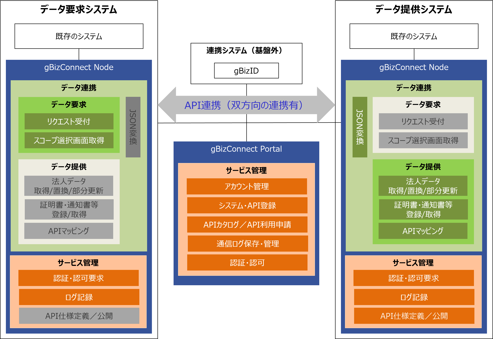
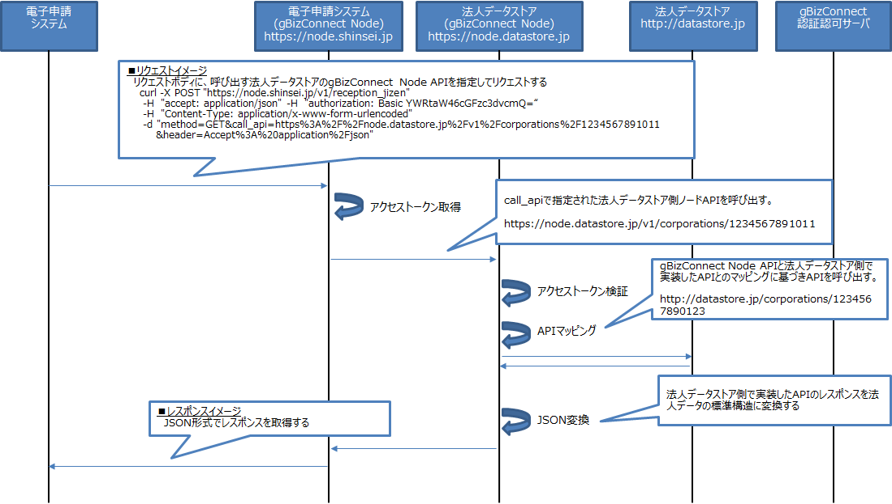
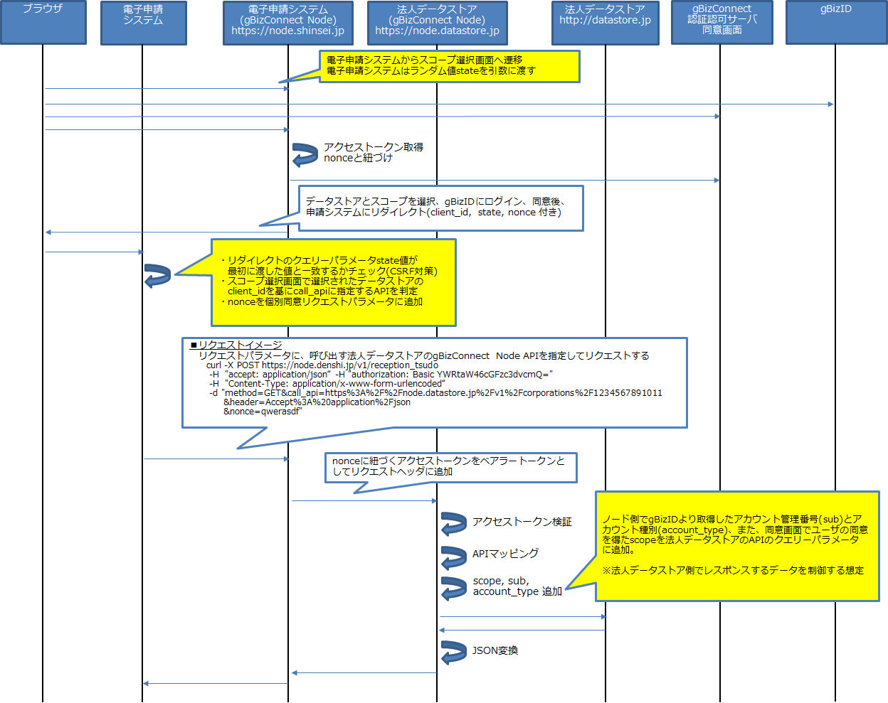
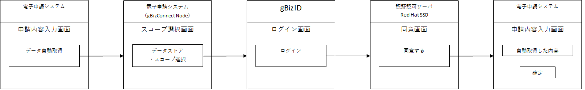
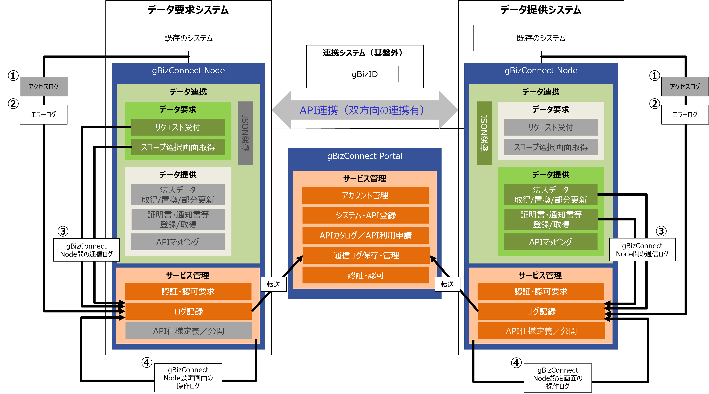

# gBizConnect Node 仕様書

## 1.	はじめに
本書はgBizConnect Nodeの仕様書です。
gBizConnectのシステム全体図を以下に示します。
<div align="center">


図１ gBizConnect　システム全体像  
※グレーアウトされた機能は、取得側または提供側の立場では使わないものを指します
</div>

|#|機能(図1)|本ドキュメント記載箇所|
|:-:|:-|:-|
|1|Node|2.11. gBizConnect Node設定ファイル|
|2|リクエスト受付|2.6. 個別同意|
|3|スコープ選択画面取得|2.7. gBizConnectのスコープ|
|4|認証・認可要求|2.3. 認証認可|
|5|ログ記録|2.10. ログ|
|6|APIによるシステム連携|2.9. gBizConnect Node間の通信|
|7|JSON変換|2.5. JSON変換|
|8|法人データ取得/置換/部分更新|2.2. API一覧|
|9|証明書・通知書等登録/取得|2.2. API一覧|
|10|APIマッピング|2.4. APIマッピング|
|11|API仕様定義／公開|2.13 API仕様定義／公開|
|12|既存のシステム|2.8. gBizConnect Node導入システムが実装する必要があるAPI|

次章にgBizConnect Nodeの詳細を記載します。

## 2. gBizConnect Node 詳細
### 2.1. APIを使用したデータ連携のイメージ
gBizConnect Node APIを使用してgBizConnectに参加しているシステム間で法人データ等の連携を行う際のイメージを示します。gBizConnectでは、データ連携を行う際に事業者自身の同意（事前同意と個別同意）に基づき開示制御を行う考え方があります。データ連携時の事前同意と個別同意のフローのイメージを示します。

<br>
<br>

<div align="center">


　図2.1-1 事前同意のフローのイメージ
</div>
<br>
<div align="center">


　図2.1-2 個別同意のフローのイメージ（事前同意のフローとの差異を黄色吹出に記載）
</div>
<br>

### 2.2. API一覧  
gBizConnect NodeのAPIを下表に示します。なお、各APIの詳細はSwagger UIを参照してください。  

|種類|API|概要|
|:-|:-|:-|
|受付API|事前同意リクエスト受付|事前同意のある法人データストアのAPIを呼び出します。|
||個別同意リクエスト受付|個別同意でユーザの同意を得たスコープで法人データストアのAPIを呼び出します。|
|法人データAPI|法人番号一覧取得|法人番号の一覧を取得します。|
||法人データ取得|法人番号で指定された法人の法人データを取得します。|
||法人データ置換|法人番号で指定された法人の法人データを置換します。|
||法人データ部分更新|法人番号で指定された法人の法人データを部分的に更新します。|
|証明書・通知書等API|証明書・通知書等番号一覧取得|法人番号で指定された法人の証明書・通知書等の通知番号一覧を取得します。|
||証明書・通知書等登録|法人番号で指定された法人の証明書・通知書等を登録します。|
||証明書・通知書等取得|法人番号と通知番号で指定された証明書・通知書等を取得します。|
|スコープ選択画面API|スコープ選択画面取得|個別同意のスコープ選択画面を返します。|  

**各APIの概要**

* 受付API：gBizConnect Nodeを導入した自システムから呼び出されるAPI  
受付APIは、gBizConnect Nodeを導入した自システムが、他システムのgBizConnect NodeのAPIを呼び出す際に使用します。呼び出す別システムのAPIを受付APIにパラメータとして渡すことでgBizConnect Nodeが受け取ったAPIを呼び出します。  
受付APIはTLS通信とBasic認証で保護されています。  
gBizConnect Nodeは受付APIで受け付けたAPI呼び出しの際API保護のため認証認可処理を行います。  
電子申請システムから電子申請システム（gBizConnect Node）のAPI呼び出しが該当します。

* 法人データAPI、証明書・通知書等API：他システムのgBizConnect Nodeから呼び出されるAPI  
法人データAPI、証明書・通知書等APIは、他システムのgBizConnect Nodeから呼び出されると、gBizConnect NodeのAPIと自システムのAPIのマッピング設定にしたがってAPI呼び出しを自システムのAPIに変換し自システムのAPIを呼び出します。  
法人データAPI、証明書・通知書等APIはTLS通信とベアラートークンで保護されています。  
gBizConnect NodeのAPIから呼び出す自システムのAPIが必要です。新規作成したAPIまたは既存のAPIをマッピング設定します。  
gBizConnect NodeはAPIの呼び出しのアクセス制御処理を行います。  
gBizConnect Nodeは個別同意でのAPIの呼び出しの場合、自システムAPIの呼び出し時にgBizIDのsub（アカウント管理番号）とaccount_type（アカウント種別）をクエリーパラメータに追加します。  
gBizConnect Nodeは自システムのAPIへのリクエストのJSONとレスポンスのJSONに対して、設定にしたがって、JSONの変換を行います。  
電子申請システム（gBizConnect Node）から法人データストア（gBizConnect Node）のAPI呼び出しが該当します。  

* 個別同意スコープ選択画面表示API：スコープ選択画面を表示するAPI   
個別同意でユーザが法人データを取得するデータストアとスコープを選択する画面をレスポンスします。個別同意では、ユーザがデータストアとスコープを選択し、gBizIDにログインし、データストアとスコープについての同意を得た後、自システムにリダイレクトします。  
自システムではリダイレクトのクエリーパラメータのstate値のチェックをします。  
自システムではリダイレクトのクエリーパラメータnonce値を受付APIに渡します。  


### 2.3. 認証認可  
gBizConnect Nodeは他システムのgBizConnect NodeのAPIの呼び出し時に、以下の認証認可処理を行います。   


|対象|処理内容|
|:-|:-|
|呼び出す側|事前同意の場合<br>・OAuth 2.0 Client Credentials Grantを使用してgBizConnect Portalの認証認可サーバよりアクセストークン取得<br>個別同意の場合<br>・OpenID Connect Authorization Code Flowを使用して、スコープ選択画面、gBizIDへのログイン、gBizConnect Portal認証認可サーバの同意画面を経てgBizConnect Portal認証認可サーバよりアクセストークンを取得|
||アクセストークンをベアラートークンとして他システムのgBizConnet NodeのAPI呼び出しのリクエストヘッダに追加|
|呼び出される側|ベアラートークンとして受け取ったアクセストークンをgBizConnect Portalの認証認可サーバにイントロスペクションリクエストし検証結果をチェック|
||アクセストークンのazpクレーム値がgBizConnect Portalで利用許可したシステムのクライアントIDと一致するかチェック|
||アクセストークンのaudクレーム値が自身のクライアントIDと一致するかチェック|
||呼び出されるAPIがgBizConnect Portalで利用許可したAPIと一致するかチェック|  


### 2.4. APIマッピング  
gBizConnect Node間で呼び出される側のgBizConnect NodeのAPIが呼び出され認証認可処理が正常終了すると、gBizConnect NodeはAPIマッピング設定にしたがってリクエストを変換し自身を導入したシステムのAPIを呼び出します。  

呼び出される側のgBizConnect Nodeを導入するシステムは、gBizConnect Nodeから呼び出されるAPIを用意（新規作成するか既存のAPI）し、gBizConnect Nodeの法人データAPI、証明書・通知書等APIとマッピングします。  
用意するAPIは、gBizConnect Nodeの法人データAPI、証明書・通知書等APIの仕様のレスポンスを返すようにします。既存のAPIを利用する場合で、仕様のレスポンスを返せない場合は、JSON変換機能を使用して、自システムのAPIのレスポンスをgBizConnect Node APIのレスポンスに変換することができます。  

APIマッピングの設定方法は「[gBizConnect Node 導入マニュアル](./gBizConnectNode_Manual.md)」を参照してください。  


### 2.5. JSON変換  
gBizConnect Nodeは、受付APIのパラメータmethodの値に応じて、GETの場合は、導入システムのAPIのレスポンスのJSON、POST、PUT、PATCHの場合は、リクエストのbodyパラメータのJSONの構造を設定にしたがって変換することができます。JSON変換を使用することで、導入システムのJSONの構造を知ることなく、gBizConnectの標準法人データJSONでデータ連携を行えます。  
JSON変換ではインプットとなるJSONとアウトプットとなるJSONのキー同士を対応付けることで、JSONの構造を変換します。JSONの値は変更しません。JSON変換の設定はAPIごとに設定できます。  

JSON変換の設定方法は「gBizConnect Node 導入マニュアル」を参照してください。  


### 2.6. 個別同意（プロト）  
gBizConnectの個別同意は、法人データ等をシステムが取得する必要がある場合に、法人データ等をどのデータストアからどの範囲（スコープ）で取得するかの選択と同意をユーザから得た上でデータ取得を行います。  

個別同意のフローとシステムで実装が必要な内容は次の通りです。  

|フロー|システムで実装が必要な内容|
|:-|:-|
|システムの画面からgBizConnect Nodeのスコープ選択画面に遷移する<br>遷移時に次のクエリーパラメータが必要<br>・state|・CSRF対策のためシステムのユーザのセッションごとにユニークなトークンを生成しセッションに保存する<br>・システムの画面にgBizConnect Nodeのスコープ選択画面APIへのリンクを追加する。リンクのクエリーパラメータstateに生成したトークンを指定する|
|スコープ選択画面でユーザがデータストアとスコープを選択する|なし|
|gBizIDにユーザがログインする|なし|
|gBizConnect Portalの認証認可サーバの同意画面でユーザが内容に同意する|ユーザが同意しない場合にシステムに戻るためのURLをgBizConnect Nodeに設定する|
|ユーザが同意した場合にgBizConnect Nodeはブラウザをシステムにリダイレクトさせる。<br>gBizConnect NodeはリダイレクトURLに次のクエリーパラメータを追加する<br>・client_id：ユーザが選択したデータストアのクライアントID<br>・nonce：個別同意リクエスト受付APIの呼び出しに必要なパラメータ<br>・state：スコープ選択画面APIに渡された値|・ユーザが同意した場合のシステムのリダイレクト先のURLをgBizConnect Nodeに設定する<br>・リダイレクト先のURLにリクエストが来た場合、クエリーパラメータstateの値とセッションに保存してあるstateの値が一致するかチェックする|
|システムからgBizConnect Nodeの個別同意リクエスト受付APIを呼び出す|・リダイレクトのクエリーパラメータclient_idの値でユーザが選択したデータストアを判定して呼び出すAPIリクエストを作成する<br>・gBizConnect Nodeの個別同意リクエスト受付APIを呼び出す|

個別同意の画面遷移のイメージは次のとおりです。
<div align="center">

図2.6-1 個別同意画面遷移イメージ
</div>
<br>

### 2.7. gBizConnectのスコープ  
gBizConnectでは、法人データの取得範囲をスコープで定義しています。gBizConnect Node APIのscopeパラメータを指定することで、法人データの必要な範囲だけを取得することができます。scopeパラメータを指定しない場合はすべてのスコープを指定したとみなします。  

|スコープ|説明|
|:-|:-|
|kihon|法人データの基本|
|shinsei|法人データの申請|
|zaimujoho|法人データの財務情報|
|shomeisho|証明書|

### 2.8. gBizConnect Node 導入システムが実装する必要があるAPI  
他システムのgBizConnect NodeからAPIを呼び出される側のgBizConnect Nodeを導入するシステムは、自身のgBizConnect Nodeから自システムに対して呼び出されるAPIを実装（新規作成するか既存のAPIを使用）する必要があります。  
実装するAPIの仕様はgBizConnect Node APIの法人データAPI、証明書・通知書等APIの仕様に準拠する必要があります。   
既存のAPIで使用できるものがある場合は、実装する必要はありません。   

APIを実装する場合の前提は以下の通りです。  

|項目|内容|
|:-|:-|
|プロトコル|httpsまたはhttp|
|リクエストのContent-Type（POST, PUT, PATCHの場合）|Application/json; charset=utf-8|
|レスポンスのContent-Type（GET, POST, PUT, PATCHの場合）|application/json; charset=utf-8|
|API認証|なし|
|正常時のレスポンスステータスコード（GET, PUT, PATCHの場合）|200|
|正常時のレスポンスステータスコード（POSTの場合）|201|
|異常時のレスポンスステータスコード|400（Bad Request）、404（Not Found）|

【下記の内容は検討段階であり今後法人データストアの要件の検討により変わります】  

個別同意リクエストの場合、gBizConnect Nodeは自システムのAPIを呼び出す際に、クエリーパラメータにscope, sub, account_typeを追加します。  

|クエリーパラメータ|説明|
|:-|:-|
|scope|個別同意でユーザが同意したスコープ<br>複数のスコープがある場合は半角スペース（%20）区切り|
|sub|gBizIDのアカウント管理番号（内部的なIDを返却）|
|account_type|gBizIDのアカウント種別<br>（1：gBizIDエントリー、2：gBizIDプライム、3：gBizIDメンバー）|

自システムのデータ管理でのgBizIDのアカウント管理番号subの使用有無とgBizIDのアカウント種別によって、データの取得範囲を制御します。  

|条件　項目|条件　値|1|2|3|4|5|
|:-|:-|:-:|:-:|:-:|:-:|:-:|
|データ管理でのsubの使用有無|使用あり|○|○|○|○||
||使用なし|||||○|
|クエリーパラメータsub|あり|○|○|○||/|
||なし||||○|/|
|クエリーパラメータaccount_type|	1：gBizIDエントリー|○|||/|/|
||2：gBizIDプライム||○||/|/|
||3：gBizIDメンバー|||○|/|/|
|データ取得範囲|subに紐づくすべて	||○|○|||
||指定した法人番号だけ|○|||○|○|


### 2.9. gBizConnect Node間の通信  
(1) TLS通信   
gBizConnect Node間のTLS通信は「SSL/TLS暗号設定ガイドライン」に記載されている高セキュリティ型の暗号スイートを設定しています。  
「SSL/TLS暗号設定ガイドライン」はIPAの下記URLに掲載されています。  
https://www.ipa.go.jp/security/vuln/ssl_crypt_config.html  


(2) エラーレスポンス  
gBizConnect Nodeの処理中にエラーが発生した場合、エラーコードはHTTP Statusコードで返却し、エラーメッセージはJSONで返却します。JSONの構造は次の通りです。  

|キー	||バリュー|
|:-|:-|:-|
|"error"||-|
||"Message"|"エラーメッセージ"|  

エラーレスポンス例  
```
HTTP/1.1 400 Bad Request
Content-Type: application/json; charset=utf-8

{"error":{"message":"Config file is not JSON"}}
```

エラーレスポンスのメッセージは「2.9.(3)」を参照してください。  

(3) 各種コード  
　①HTTPのメッセージ  

|ステータス|メッセージ|内容|
|:-|:-|:-|
|200|OK|正常終了|
|201|Created|正常終了（POST）|
|204|No Content|正常終了|
|400|Bad Request|リクエストに問題がある|
|401|Unauthorized|認証されていない|
|403|Forbidden|権限がない|
|404|Not Found|リソースが存在しない|
|500|Internal Server Error|サーバ側でエラーが発生|
|502|Bad Gateway|プロキシのエラー|
|503|Service Unavailable|サービスの利用不可|
|504|Gateway Timeout|プロキシのタイムアウト|

　②gBizConnect Node独自のエラーメッセージ  

|ステータス|メッセージ|発生原因|
|:-|:-|:-|
|500|Config file is not JSON.|	config.jsonがJSON形式のデータではない場合|
|500|Permission denied|	config.jsonに権限がない場合|
|500|No such file or directory|	config.jsonがない場合|
|400|No Request Body.|受付APIへのリクエストにボディがない場合|
|400|This parameter[call_api] is missing.	|受付APIへのリクエストのcall_apiパラメータがない場合|
|400|This parameter[method] is missing.|受付APIへのリクエストのmethodパラメータがない場合|
|400|This header parameter[Content-Type] is missing.|受付APIへのリクエストのheaderパラメータ(Content-Type)がない場合|
|400|This method[GET] does not require HTTP Request body.|受付APIへのリクエストのmethodパラメータがGETの場合でbodyパラメータがある場合|
|400|This method[POST/PUT/PATCH] requires HTTP Request body.|受付APIへのリクエストのmethodパラメータがGET以外の場合でbodyパラメータがない場合|
|400|This parameter[【不正なパラメータ※】] does not contain equals.|受付APIへのリクエストのパラメータに"="がないものがある場合(※methodGET等)|
|400|This parameter[【不正なパラメータ※】] contains multiple equals.|受付APIへのリクエストのパラメータに"="が2つ以上ある場合(※method==GET等)|
|400|This header parameter[【重複パラメータ名】] has multiple keys.|受付APIへのリクエストに重複するヘッダーのパラメータ名がある場合|
|400|This parameter[【重複パラメータ名】] has multiple keys.|受付APIへのリクエストに重複するパラメータ名がある場合|
|400|This parameter[call_api] must start with http or https.[【パラメータ値】]"|受付APIへのリクエストのcall_apiパラメータがhttpかhttpsで始まらない場合|
|400|This header parameter[Content-Type] is not [application/json].|受付APIへのリクエストのheaderパラメータ(Content-Type)がapplication/jsonではない場合|
|400|This parameter[body] is not JSON.|受付APIへのリクエストのbodyパラメータがJSON形式のデータではない場合|
|400|Unable to get client_id of Destination Server.|他システムのgBizConnect Nodeのclient_idが取得できない場合|
|4xx|Failed to call Authorization Server.|認証認可サーバへのリクエストでエラーが発生<br>・config.jsonのoauthの設定値が正しくない場合|
|5xx|Failed to call Authorization Server.|認証認可サーバへのリクエストでエラーが発生<br>・config.jsonのoauthの設定値が正しくない場合<br>・認証認可サーバが停止している場合|
|400|INVALID_CREDENTIALS: Invalid client credentials|config.jsonのclient_idの設定値が正しくない場合|
|400|Invalid client secret|config.jsonのclient_secretの設定値が正しくない場合|
|400|Invalid client credentials|gBizConnect Portalでシステムが廃止されている場合|
|400|Client not enabled to retrieve service account|	gBizConnect Portalのシステムの設定が異常な場合|
|4xx|Failed to call the External API.|受付APIへのリクエストのcall_apiパラメータのURLへのリクエストエラーが起きた場合|
|5xx|Failed to call the External API.|受付APIへのリクエストのcall_apiパラメータのURLへのリクエストエラーが起きた場合|
|403|Client ID does not match with aud. (aud: 【アクセストークンのaud】)|受付APIへのリクエストのcall_apiパラメータのURLへのリクエストを受け付けたgBizConnect Nodeのclient_idとアクセストークンの宛先のclient_id（aud）が一致しない場合|
|403|Could not get Client ID from access token.|受付APIへのリクエストのcall_apiパラメータのURLへのリクエストを受け付けたgBizConnect Nodeで、アクセストークンからリクエスト元のclient_idが取得できない場合|
|403|Unpermitted Client ID. (【gBizConnect Node導入自システムのクライアントID】)|受付APIへのリクエストのcall_apiパラメータのURLへのリクエストを受け付けたgBizConnect Nodeで、リクエスト元のシステムのAPI利用を1つも承認していない場合|
|403|Unpermitted URI. (【call_apiパラメータ,methodパラメータ】)|受付APIへのリクエストのcall_apiパラメータのURLへのリクエストを受け付けたgBizConnect Nodeで、リクエスト元のシステムのcall_apiで指定されたAPIの利用を承認していない場合|
|500|This URI cannot do API mapping.(call_api:【call_api_uri】)|APIマッピングができない場合|

### 2.10.	ログ
(1)	ログの内容  
ログの出力対象は、「gBizConnect Nodeのアクセスログ」「エラーログ」「gBizConnect Node間の通信ログ」  
「gBizConnect Node設定画面の操作ログ」です。ログの通信イメージを以下に示します。

<div align="center">
  

図2.10-1 ログ通信イメージ
</div>

以下のディレクトリにログを出力します。  
　① アクセスログ：gBizConnect Nodeのインストールディレクトリ/edge-module/log/access.log  
　② エラーログ：gBizConnect Nodeのインストールディレクトリ/edge-module/log/error.log  
　③ gBizConnect Node間の通信ログ：gBizConnect Nodeのインストールディレクトリ/edge-module/log/error.log  
　④ gBizConnect Node設定画面の操作ログ：
gBizConnect Nodeのインストールディレクトリ/config-php-script/log/php_error.log

①アクセスログは以下の形式で出力します。
```
$remote_addr - $remote_user [$time_local] "$request" $status $body_bytes_sent "$http_referer" "$http_user_agent" "$http_x_forwarded_for"
```
アクセスログの項目と内容    

|項目|内容|
|:-|:-|
|$remote_addr|client address|
|$remote_user|user name supplied with the Basic authentication|
|$time_local|local time in the Common Log Format|
|$request|full original request line|
|$status|response status|
|$body_bytes_sent	|number of bytes sent to a client, not counting the response header|
|$http_referer|referrer
|$http_user_agent|user-agent|
|$http_x_forwarded_for|x-forwarded-for|

>出典元：http://nginx.org/en/docs/http/ngx_http_core_module.html#variables    

③gBizConnect Node間の通信ログはエラーログに出力します。通信ログの内容は下表のとおりです。  

通信ログの項目と内容  

|項目|内容|
|:-|:-|
|システム部|yyyy/MM/dd hh:mm:ss [ログレベル] 6#6: *1 js:|
|ログレベル|Info, Warn, Error|
|識別ID|gBizConnect Nodeの受付APIでリクエストを受け付けてからレスポンスするまでの間にgBizConnect Node間でやり取りされた通信を識別するID|
|実行日時|yyyy/MM/dd HH:mm:ss.SSS<br>ログ出力の日時|
|リクエスト元ドメイン|<ホスト名>[:<ポート番号>]|
|リクエスト先ドメイン|<ホスト名>[:<ポート番号>]|
|リクエスト先URI|<スキーム名>://<ホスト名>[:<ポート番号>]<パス>|
|リクエストメソッド|GET, POST, PUT, PATCH|
|メッセージ|Succeeded in calling the Internal API.<br>（自システムから自システムのgBizConnect Nodeへのリクエストが完了した際に出力されます。）|
||Called Authorization Server.<br>（自システムのgBizConnect NodeからgBizConnect Portalの認証認可サーバへのリクエストを送る際に出力されます。）|
||Succeeded in calling Authorization Server.<br>（gBizConnect Portalの認証認可サーバから自システムのgBizConnect Nodeへのリクエストが完了した際に出力されます。）|
||Called the External API.<br>（自システムのgBizConnect Nodeから他システムのgBizConnect Nodeへのリクエストを送る際に出力されます。）|
||Succeeded in calling the External API.(request_time:[x.xxx]s)<br>[x.xxx]は一連のリクエスト開始から終了までの処理時間（秒）<br>（他システムのgBizConnect Nodeから自システムのgBizConnect Nodeへのリクエストが完了した際に出力されます。）|
||Called the Internal API.<br>（自システムのgBizConnect Nodeから自システムへのリクエストを送る際に出力されます。）|
|拡張|gBizConnect Portalの設定でログの出力項目が追加されます|  

④gBizConnect Node設定画面の操作ログの内容は下表のとおりです。  

設定画面の操作ログの項目と内容   

|項目|内容|
|:-|:-|
|実行日時|yyyy/MM/dd HH:mm:ss.SSS<br>ログ出力の日時|
|メッセージ|The data has been updated.<br>（config.jsonが正常に更新された場合）
||The file is not JSON format.<br>（config.jsonがJSON形式ではない場合）|
||The file or folder cannot be accessed.(Exception information:[【例外情報】])<br>（config.json読み込み時に異常が検出された場合）|

(2)	gBizConnect Portalへのログ転送  
gBizConnect Nodeは通信ログをgBizConnect Portalに転送します。転送の仕様は下表のとおりです。  

|項目|内容|
|:-|:-|
|転送間隔|1回/1日（td-agentのDockerコンテナ起動時に開始）|
|リトライ回数|3回（2分間隔）|
|バックアップ|リトライ転送失敗時、転送に失敗したログをコンテナ内の下記ディレクトリに保存<br>/var/log/td-agent/ |

通信ログの転送に失敗した場合、リトライします。リトライ回数分失敗した場合、ログはバックアップディレクトリに保存されます。保存されたログは、バックアップディレクトリに保存されています。  

(3)	gBizConnect Portalでのログ参照  
gBizConnect Nodeの通信エラーの調査で、他システムのgBizConnect Nodeの通信ログを参照する必要がある場合は、gBizConnect Portalで参照します。  
詳細は「[gBizConnect Portal利用者マニュアル](./Riyoushamuke_Manual.md)」を参照してください。  

### 2.11. gBizConnect Node 設定ファイル  
(1) gBizConnect Node設定ファイル仕様  
gBizConnect Node設定ファイルは、認証認可、APIマッピング、JSON変換、ログ出力項目を設定するファイルです。設定内容はJSON形式で設定します。gBizConnect Portalからダウンロードします。gBizConnect Portalで自動設定される項目と、gBizConnect Node導入システム側で手動設定する項目があります。gBizConnect Node設定ファイルの仕様について記載します。  

|キー|||バリュー|自動設定(*1)|手動設定(*2)|内容|
|:-|:-|:-|:-|:-|:-|:-|
|client_id|||string|○|変更禁止	|自システムのgBizConnect NodeのOAuth 2.0のクライアントIDです。認証認可処理で使用します。|
|client_secret|||string|○|変更禁止|自システムのgBizConnect NodeのOAuth 2.0のクライアントシークレットです。<br>認証認可処理で使用します。|
|authorized_client_list|||array|○|変更禁止|他システムのgBizConnect NodeのクライアントIDと、その他システムに対し利用を承認した自システムのgBizConnect NodeのAPIの情報です。以下のキーを持つobjectの配列です。|
||client_id||string|○|変更禁止|API利用を承認された他システムのgBizConnect Node のOAuth 2.0のクライアントIDです。|
||endpoint||array|○|変更禁止|上記client_idを持つ他システムのgBizConnect Nodeに対して利用を承認した自システムのgBizConnect NodeのAPIのエンドポイントの情報です。以下のキーを持つobjectの配列です。|
|||uri|string|○|変更禁止|自システムのgBizConnect NodeのAPIのエンドポイントのパスです。|
|||method|string|○|変更禁止|自システムのgBizConnect NodeのエンドポイントのAPIのメソッドです。|
|internal_api_mappings|||array|-|○|APIマッピングの情報を持ちます。導入する自システムのAPIのエンドポイントはsystem_api_addr + system_api_uri_replaceで生成されるURLとなります。<br>以下のキーを持つobjectの配列です。|
||system_api_addr||string|-|○|導入する自システムのAPIのURLから「<スキーム名>://<ホスト名>[:<ポート番号>]」を設定します。<br>・<スキーム名>は「https://」または「http://」のみ設定できます。<br>・ [:<ポート番号>]は各スキームのデフォルトポートの場合省略可能です。|
||system_api_uri_extract||string|-|○|自システムのgBizConnect NodeのAPIのエンドポイントのパスを設定します。正規表現を使用して下さい。先頭に^,末尾に $を使用しないと予期せぬマッピングがされる可能性があります。|
||system_api_uri_replace||string|-|○|導入する自システムのAPIのエンドポイントのパスを設定します。上記のsystem_api_uri_extractで、()でグループ化した文字列とマッチした部分を、$n(n>0)で参照し、埋め込むことができます。|
|json_converts|||array|-|○|JSON変換の情報を設定します。<br>以下のキーを持つobjectの配列です。|
||json_convert_get_flag||boolean|-|○|導入システムのAPIからレスポンスされたJSONのキーをgBizConnectの標準法人データJSONのキーに変換するかしないかを設定します。<br>true：JSON変換する<br>false：JSON変換しない|
||json_convert_set_flag||boolean|-|○|導入システムのAPIを呼び出す前にgBizConnectの標準法人データJSONのキーを導入システムのJSONのキーに変換するかしないかを設定します。<br>true：JSON変換する<br>false：JSON変換しない|
||json_convert_uri||string|-|○|JSON変換を実行する自システムのgBizConnect NodeのAPIのエンドポイントのパスを設定します。正規表現を使用して下さい。先頭に^,末尾に $を使用しないと予期せぬJSON変換が行われる可能性があります。|
||json_convert_method||string|-|○|JSON変換を実行する自システムのgBizConnect NodeのAPIのエンドポイントのメソッドを設定します。|
||json_convert_rule||string|-|○|JSON変換で実行するルール名を設定します。json_convert_rulesのキーを一つ指定します。|
|json_convert_rules|||array|-|○	|gBizConnectの標準法人データJSONと導入システムのJSONのキーのマッピングを設定します。<br>以下のキーを持つobjectの配列です。|
||JSON変換ルール名（手動設定）||object|-|○|任意のユニークな名前を設定します。<br>以下のキーを持つobjectの配列です。|
|||response|string|-|○|gBizConnectの標準法人データJSONのキーを設定します。<br>ObjectがさらにObjectを持つような入れ子の場合、キーは階層を設定できます。<br>{"A":{"B":{"C":"D"}}}の"C"は"A.B.C"と設定します。|
|||datastore|string|-|○|導入システムのJSONのキーを設定します。<br>ObjectがさらにObjectを持つような入れ子の場合、キーは階層を設定できます。<br>{"A":{"B":{"C":"D"}}}の"C"は"A.B.C"と設定します。|
|authorized_server_list|||array|○|変更禁止|自システムが利用する他システムのgBizConnect Node のAPIのエンドポイントのホスト名とクライアントIDの情報を持ちます。<br>gBizConnect Portalで他システムのAPIの利用を承認されている場合に設定されます。<br>以下のキーを持つobjectの配列です。|
||domain||string|○|変更禁止|自システムのgBizConnect Nodeで利用する、他システムのgBizConnect Node のAPIのエンドポイントのホスト名です。|
||client_id||string|○|変更禁止|自システムのgBizConnect Nodeで利用する、他システムのgBizConnect NodeのクライアントIDです。|
|log_nginx_variables|||array|○|変更禁止|ログ出力項目です。<br>以下のキーを持つobjectの配列です。|
||log_nginx_variable||string|○|変更禁止|設定値はnginx内で使用できる変数名です。|
||flag||boolean|○|変更禁止|log_nginx_variableに設定した項目のログ出力有無を持ちます。<br>true：ログ出力あり<br>false：ログ出力なし|
|oauth|||object|○|変更禁止|OAuth 2.0のエンドポイントの設定です。<br>以下のキーを持つobjectです。|
||oauth_token_introspect_endpoint||string|○|変更禁止|OAuth 2.0のイントロスペクションエンドポイントです。<br>認証認可処理で使用します。|
||oauth_token_endpoint||string|○|変更禁止|OAuth 2.0のトークンエンドポイントです。<br>認証認可処理で使用します。|
||discovery||string|○|変更禁止|OpenID Connect Discovery 1.0のOpenID Provider Configuration RequestのURLです。<br>認証認可処理で使用します。|
|openid_connect|||object|-|○|OpenID Connectの設定です<br>以下のキーを持つobjectです。|
||no_consent_url||string|-|○|同意画面でユーザが同意しなかった場合にリダイレクトする導入システムのURLです。<br>認証認可処理で使用します。|
||post_authorized_url||string|-|○|同意画面でユーザが同意した場合にリダイレクトする導入システムのURLです。<br>認証認可処理で使用します。|
||redirect_uri||string|-|○|OpenID Connect 1.0のリダイレクトURLです。以下のURLを指定します。<br>`https://node.example.jp[:port]<br>/v1/auth/redirect_uri` (*3)<br>認証認可処理で使用します。|  

(* 1)自動設定が○の項目はgBizConnect Portalからダウンロードした設定ファイルに設定されています。設定値を変更しないでください。  
(* 2)手動設定が○の項目はgBizConnect Node導入システム側で設定が必要です。  
(* 3)「node.example.jp[:port]」の意味は以下の通りです。  
「node.example.jp」はgBizConnect Nodeを導入するサーバのホスト名です。  
「[:port]」はDockerコンテナedge-moduleの公開ポート番号で443の場合省略可能です。  
指定例：node.example.jp、node.example.jp:443


(2)	gBizConnect Node設定ファイルサンプル  
設定ファイルのサンプルを示します。  

* 電子申請システム側gBizConnect
```json
{
    "client_id":"xxxxxxxxxxxxx-xxxx-xxxx-xxxxxxxxxxxx",
    "client_secret":"wwwwwwwwwwwww-wwww-wwww-wwwwwwwwwwww",
    "authorized_server_list":[
        {
            "domain":"https://edge.datastore.jp",
            "client_id":"yyyyyyyyyyyyy-yyyy-yyyy-yyyyyyyyyyyy"
        }
    ],
    "log_nginx_variables":[
        {
            "log_nginx_variable":"content_type",
            "flag":false
        },
        {
            "log_nginx_variable":"nginx_version",
            "flag":false
        }
    ],
    "oauth":{
        "oauth_token_introspect_endpoint": "https://xxx.go.jp/auth/realms/gbizconnect/protocol/openid-connect/token/introspect",
        "oauth_token_endpoint": "https://xxx.go.jp/auth/realms/gbizconnect/protocol/openid-connect/token",
        "discovery":"https://xxx.go.jp/auth/realms/gbizconnect/.well-known/openid-configuration"
    },
    "openid_connect":{
        "no_consent_url":"https://app.denshi.jp/no_consent",
        "post_authorized_url":"https://app.denshi.jp/post_authorized",
        "redirect_uri": "https://node.denshi.jp/v1/auth/redirect_uri"
    }
}
```

### 2.12.	gBizConnect Node設定画面  
gBizConnect Node設定ファイルをgBizConnect Nodeに反映させる画面です。  
gBizConnect Nodeの起動後、以下のURLでアクセスできます。  
`http://node.example.jp:8080/setting.php`  
gBizConnect Node設定画面は外部公開しないでください。  


### 2.13.	API仕様定義／公開
gBizConnect NodeはSwagger API仕様で記述されたgBizConnect Node API仕様を公開できるようにSwagger UIを使用します。  
Swagger UIでAPIを試行された際のテストデータはJSON Serverを使用してレスポンスします。  
gBizConnect Node API以外に導入システム独自のAPI仕様を追加できるようにSwagger Editorを使用します。   

#### 2.13.1.	API仕様定義  
gBizConnect Nodeの起動後、Swagger Editorに以下のURLでアクセスできます。  
`https://node.example.jp[:port]/swaggereditor/`  

#### 2.13.2.	API仕様公開
gBizConnect Nodeの起動後、Swagger UIに以下のURLでアクセスできます。  
`https://node.example.jp[:port]/swaggerui/`  

gBizConnect Nodeの起動後、JSON Serverに以下のURLでアクセスできます。   
`https://node.example.jp[:port]/jsonserver/`  

 
## 3. gBizConnect標準データ項目  
※本節に記載の内容は検討中の内容のため今後変わる可能性があります。  

gBizConnectに参加するシステム間でのデータ連携で受け渡されるデータのフォーマットはJSONです。gBizConnectでは標準データとして以下のデータ項目をJSONで表現します。  
標準データのスコープとして基本情報、申請情報、財務情報、証明書情報を定義しています。  

### 3.1.	標準データのスコープとデータ項目  
　2019年12月時点の標準データ項目であり、今後変更する可能性があります。  

* 基本情報  

データ項目(申請書基本)  

|ブロック名|項目<br>No.|項目名|区分|説明|形式|記入例|
|:-|:-|:-|:-|:-|:-|:-|
|宛先|1-1|法人番号|◎|法人に割り当てられる一意の番号（13桁）|文字列（半角数字）|1234567891011|
||1-2|法人名|○|法人の商号又は名称|文字列|○○株式会社|
||1-3|法人名(カナ）|○|法人の商号又は名称のカナ表記|文字列（全角カナ）|マルマルカブシキガイシャ|
||1-4|本社所在地||法人の住所の全文表記（都道府県から記入し、丁目以下は半角数字とハイフンで記入）|文字列|東京都千代田区霞が関1-3-1|
||1-5|本社建物名||法人の住所の建物名|文字列|霞ヶ関○○ビル|
||1-6|事業所名||法人に関連する、支店などの名称|文字列|○○株式会社神奈川支社|
||1-7|事業所所在地||法人に関連する、支店などの住所の全文表記（都道府県から記入し、丁目以下は半角数字とハイフンで記入）|文字列|神奈川県川崎市中原区小杉町1-1-1|
||1-8|事業所建物名||法人に関連する、支店などの建物名|文字列|武蔵小杉○○ビル|
||1-9|事業所郵便番号||法人に関連する、支店などの郵便番号（ハイフンなしの７桁）|文字列（半角数字）|1234567|
||1-10|申請日||申請書の提出日（西暦年月日とし、半角数字をハイフンでつなぐ）|日付|2010-01-01|
|内容|2-1|設立日|○|法人が設立された日（西暦年月日とし、半角数字をハイフンでつなぐ）|日付|2010-01-01|
||2-2|資本金|○|法人の資本金|文字列（半角数字）|10,000,000|
||2-3|従業員数|○|直前決算期の法人の従業員数|文字列（半角数字）|500|
||2-4|正社員数|○|直前決算期の法人の正社員数|文字列（半角数字）|400|
|連絡先|3-1|担当者部署||担当部署名|文字列|「事例サンプル」シートを参照|
||3-2|担当者役職||担当者の役職|文字列|「事例サンプル」シートを参照|
||3-3|担当者名(姓)	||担当者の姓|文字列|「事例サンプル」シートを参照|
||3-4|担当者名ヨミガナ(姓)	||担当者の姓の読み仮名|文字列（全角カナ）|「事例サンプル」シートを参照|
||3-5|担当者名(名)	||担当者の名|文字列|「事例サンプル」シートを参照|
||3-6|担当者名ヨミガナ(名)	||担当者の名の読み仮名|文字列（全角カナ）|「事例サンプル」シートを参照|
||3-7|電話番号||担当部署の電話番号（省略可能な市外局番にカッコをつけ、以降の番号はハイフンで繋げる）|文字列（半角英数字）|「事例サンプル」シートを参照|
||3-8|内線||担当部署の電話番号の内線番号|文字列（半角数字）|「事例サンプル」シートを参照|
||3-9|メールアドレス	||連絡先のメールアドレス|文字列（半角英数字）|「事例サンプル」シートを参照|
||3-10|住所||連絡先の住所の全文表記（都道府県から記入し、丁目以下は半角数字とハイフンで記入）|文字列|「事例サンプル」シートを参照|
||3-11|webフォーム||連絡先のWebフォーム|文字列（半角英数字）|「事例サンプル」シートを参照|
|発行元|4-1|法人番号|◎|法人に割り当てられる一意の番号（13桁）|文字列（半角数字）|1234567891011|
||4-2|法人名|○|法人の商号又は名称|文字列|○○株式会社|
||4-3|法人名(カナ）|○|法人の商号又は名称のカナ表記|文字列（全角カナ）|マルマルカブシキガイシャ|
||4-4|業種コード	||法人の業種をコードで表現したもの（日本標準産業分類の大分類で2桁）|文字列（半角数字）|01<br> (農業)|
||4-5|本社所在地||法人の住所の全文表記（都道府県から記入開始、丁目以下は半角数字とハイフンで記入）|文字列|東京都千代田区霞が関2-2-2|
||4-6|本社建物名||法人の住所の建物名|文字列|霞ヶ関○○ビル|
||4-7|事業所名||法人に関連する、支店などの名称|文字列|○○株式会社神奈川支社|
||4-8|事業所所在地||法人に関連する、支店などの住所の全文表記（都道府県から記入し、丁目以下は半角数字とハイフンで記入）|文字列|神奈川県川崎市中原区小杉町3-3-3|
||4-9|事業所建物名||法人に関連する、支店などの建物名|文字列|武蔵小杉○○ビル|
||4-10|事業所郵便番号||法人に関連する、支店などの郵便番号（ハイフンなしの７桁）|文字列（半角数字）|1234567|
||4-11|代表者役割||法人の代表者の役割・役職|文字列|代表取締役社長|
||4-12|代表者名(姓)|法人の代表者の姓|文字列|霞が関|
||4-13|代表者名(名)||法人の代表者の名|文字列|太郎|

* 申請情報  

データ項目（申請内容）  

|ブロック名|項目<br>No.|項目名|区分|説明|形式|記入例|
|:-|:-|:-|:-|:-|:-|:-|
|内容|1-1|名称|○|申請内容のタイトル|文字列|IT導入補助金の申請|
||1-2|概要|○|申請内容の概要|文字列|○○の情報を一元管理するためのクラウドシステムの導入|
||1-3|内容|○|申請内容|文字列|現在の○○業務に関するデータはエクセルファイルに記載され、各部署毎に..|
||1-4|更新年月日|○|申請内容の更新日（西暦年月日とし、半角数字をハイフンでつなぐ）|日付|2019-01-01|  

* 財務情報  

データ項目（財務情報）  

|ブロック名|項目<br>No.|項目名|区分|説明|形式|記入例|
|:-|:-|:-|:-|:-|:-|:-|
|内容|1-1|決算年月日|○|決算日（西暦年月日とし、半角数字をハイフンでつなぐ）|日付|2020-01-01|
||1-2|事業期間開始日|○|決算を行った事業期間の開始日（西暦年月日とし、半角数字をハイフンでつなぐ）|日付|2010-01-01|
||1-3|事業期間終了日|○|決算を行った事業期間の終了日（西暦年月日とし、半角数字をハイフンでつなぐ）|日付|2030-03-03|
||1-4|期末従業員数|○|常時雇用する従業員の期末における人数|文字列（半角数字）|500|
||1-5|資産合計|○|流動資産、固定資産、繰延資産の合計|文字列（半角数字）||
||1-5-1|流動資産合計|○|流動資産の合計|文字列（半角数字）||	　
||1-5-1-1|現金及び預金|○|現金と預金（当座、定期）の合計|文字列（半角数字）||
||1-5-1-2|受取手形|○|売上債権のうち手形として保有している額|文字列（半角数字）||
||1-5-1-3|売掛金|○|売上債権のうち手形として保有していない額|文字列（半角数字）||
||1-5-1-4|有価証券|○|有価証券の合計額|文字列（半角数字）||
||1-5-1-5|棚卸資産|○|販売目的で一時的に保有する商品・製品・原材料・仕掛品の合計額|文字列（半角数字）||
||1-5-1-6|その他流動資産合計|○|前払金、短期貸付金、貸倒引当金などの流動資産の合計|文字列（半角数字）||
||1-5-1-6-1|前払金|○|商品を受け取る前に代金を先払いした額|文字列（半角数字）||
||1-5-1-6-2|短期貸付金|○|決算日の翌日から起算して1年以内に回収される貸付金の合計額|文字列（半角数字）||
||1-5-1-6-3|貸倒引当金|○|貸倒損失になるかもしれない額|文字列（半角数字）||
||1-5-2|固定資産合計|○|固定資産の合計|文字列（半角数字）||
||1-5-2-1|有形固定資産合計|○|建物、機械装置、土地などの有形固定資産の合計|文字列（半角数字）||
||1-5-2-1-1|土地|○|土地の合計額|文字列（半角数字）||
||1-5-2-2|無形固定資産合計|○|ソフトウェア、のれんなどの無形固定資産の合計|文字列（半角数字）||
||1-5-2-3|その他固定資産合計|○|投資、長期貸付金、長期前払費用、関係会社株式などの固定資産の合計|文字列（半角数字）||
||1-5-3|貸付金合計|○|長期貸付金と短期貸付金の合計|文字列（半角数字）||
||1-6|負債合計|○|流動負債、固定負債の合計|文字列（半角数字）||
||1-6-1|流動負債合計|○|流動負債の合計|文字列（半角数字）||
||1-6-1-1|支払手形|○|営業取引によって生じた手形債務|文字列（半角数字）||
||1-6-1-2|買掛金|○|営業取引によって生じた未払金|文字列（半角数字）||
||1-6-1-3|短期借入金|○|借入金で１年以内に期限の到来するもの|文字列（半角数字）||
||1-6-1-4|その他流動負債合計|○|未払金、前受金、預り金などの合計|文字列（半角数字）||
||1-6-1-4-1|未払金|○|通常の取引に関連して発生した未払金|文字列（半角数字）||
||1-6-1-4-2|前受金|○|営業収益の前受額|文字列（半角数字）||
||1-6-1-4-3|預り金|○|後日預かった者又は第三者対して支払うべきもの|文字列（半角数字）||
||1-6-2|固定負債合計|○|固定負債の合計|文字列（半角数字）|
||1-6-2-1|長期借入金|○|到来期限が1年以上の借入金|文字列（半角数字）||
||1-7|純資産合計|○|資産から負債を引いた額|文字列（半角数字）||
||1-7-1|資本金|○|資本金|文字列（半角数字）||
||1-7-2|資本準備金|○|資本準備金|文字列（半角数字）||
||1-8|売上高|○|製品・商品等の売上高|文字列（半角数字）||
||1-9|売上原価|○|製品・商品等の原価|文字列（半角数字）|
||1-9-1|売上原価内減価償却費|○|製品・商品の製造に係る減価償却実施額|文字列（半角数字）||
||1-9-2|労務費|○|製造に関わる人件費・労務費|文字列（半角数字）||
||1-10|売上総利益|○|売上高から売上原価を引いた額|文字列（半角数字）|
||1-11|販売費及び一般管理費|○|販売費および一般管理費計|文字列（半角数字）||
||1-11-1|販管費内減価償却費|○|業に係る減価償却実施額|文字列（半角数字）||
||1-11-2|人件費|○|従業員給料、役員報酬などの合計|文字列（半角数字）|
||1-12|営業利益|○|売上総利益から販売費および一般管理費を引いた額|文字列（半角数字）||
||1-13|営業外収益|○|主に金融活動に伴う収益|文字列（半角数字）||
||1-14|営業外費用|○|主に金融活動に伴う費用|文字列（半角数字）||
||1-15|経常利益|○|本業と本業以外の損益の合計|文字列（半角数字）||
||1-16|特別利益|○|資産売却益、為替差益等|文字列（半角数字）||
||1-17|特別損失|○|資産評価損・処分損、為替差損等|文字列（半角数字）||
||1-18|税引前当期純利益|○|税引前の当期利益額	|文字列（半角数字）||
||1-19|当期純利益|○|税引前当期純利益から法人税等を引いた額|文字列（半角数字）||  

* 証明書情報  
データ項目（証明書）

|ブロック名|項目<br>No.|項目名|区分|説明|形式|記入例|
|:-|:-|:-|:-|:-|:-|:-|
|宛先|1-1|法人番号|◎|法人に割り当てられる一意の番号（13桁）|文字列（半角数字）|1234567891011|
||1-2|商号又は名称|○|法人の商号又は名称|文字列|○○株式会社|
||1-3|商号又は名称(カナ）|○|法人の商号又は名称のカナ表記|文字列（全角カナ）|マルマルカブシキガイシャ|
||1-6|本社住所||法人の住所の全文表記（都道府県から記入開始、丁目以下は半角数字とハイフンで記入）|文字列|東京都千代田区霞が関1-3-1|
||1-7|本社建物名||法人の所在地の建物名|文字列|霞ヶ関○○ビル|
||1-8|事業所名||法人に関連する、支店などの名称|文字列|○○株式会社神奈川支社|
||1-9|事業所住所||法人に関連する、支店などの住所の全文表記（都道府県から記入開始、丁目以下は半角数字とハイフンで記入）|文字列|神奈川県川崎市中原区小杉町1-1-1|
||1-10|事業所建物名||法人に関連する、支店などの建物名|文字列|武蔵小杉○○ビル|
||1-11|代表者役割||法人の代表者の役割|文字列|代表取締役社長|
||1-12|代表者名(姓)||法人の代表者の姓|文字列|霞が関|
||1-13|代表者名(名)||法人の代表者の名|文字列|太郎|
|内容|2-1|公表組織の法人番号の種類|○|公表組織の種別を明示したもの|?|?|
||2-2|発行組織の名称|○|発行組織の名称|文字列|経済産業局|
||2-3|公表組織の法人番号|○|公表組織の法人番号（13桁）|文字列（半角数字）|1111111111111|
||2-4|公表組織の名称|○|公表組織の名称|文字列|経済産業省|
||2-5|担当者部署|○|担当者部署|文字列|○○部|
||2-6|担当者役職|○|担当者役職|文字列|次長|
||2-7|担当者名(姓)|○|担当者の姓|文字列|虎ノ門|
||2-8|担当者名(名)	||担当者の名|文字列|花子|
||2-9|電話番号|○|電話番号（省略可能な市外局番にカッコをつけ、以降の番号はハイフンで繋げる）|文字列（半角英数字）|(03)3501-151|
||2-10|内線|○|内線番号|文字列（半角数字）|02|
||2-11|メールアドレス|○|メールアドレス|文字列（半角英数字）|chiyoda-jiro26@xxx.co.jp|
||2-12|証明日|○|証明の発行日（西暦年月日とし、半角数字をハイフンでつなぐ）|日付|2010-01-01|
||2-13|ID|○|証明書のID|文字列（半角英数字）||
||2-14|証明書名|○|証明の名称|文字列||
||2-15|対象|○|証明の対象|文字列||
||2-16|値|○|証明する対象に数値がある場合に記入|文字列（半角数字）||
||2-17|証明開始日|○|証明の開始日（西暦年月日とし、半角数字をハイフンでつなぐ）|日付|2000-02-02|
||2-18|証明終了日|○|証明の終了日（西暦年月日とし、半角数字をハイフンでつなぐ）|日付|2000-03-03|
||2-19|備考|○|証明に関する備考|文字列||	　
|連絡先|3-1|担当者部署||担当部署名|文字列|広報部|
||3-2|担当者役職||担当者の役職|文字列|係長|
||3-3|担当者名(姓)||担当者の姓|文字列|霞ヶ関|
||3-4|担当者名ヨミガナ(姓)||担当者の姓の読み仮名|文字列（全角カナ）|カスミガセキ|
||3-5|担当者名(名)||担当者の名|文字列|太郎|
||3-6|担当者名ヨミガナ(名)||担当者の名の読み仮名|文字列（全角カナ）|タロウ|
||3-7|電話番号||担当部署の電話番号（省略可能な市外局番にカッコをつけ、以降の番号はハイフンで繋げる）|文字列（半角英数字）|(03)3501-151|
||3-8|内線||担当部署の電話番号の内線番号|文字列（半角数字）|01|
||3-9|メールアドレス||連絡先のメールアドレス|文字列（半角英数字）|chiyoda-jiro26@xxx.co.jp|
||3-10|住所||連絡先の住所の全文表記（都道府県から記入し、丁目以下は半角数字とハイフンで記入）|文字列|東京都千代田区霞が関1-3-1|
||3-11|webフォーム||連絡先のWebフォーム|文字列（半角英数字）|http://xxx.yyy.co.jp|
|発行元|4-1|法人番号|○|法人に割り当てられる一意の番号（13桁）|文字列（半角数字）|1313131313131|
||4-2|商号又は名称|○|法人の商号又は名称|文字列|□□株式会社|
||4-3|商号又は名称(カナ）|○|法人の商号又は名称のカナ表記|文字列（全角カナ）|シカクシカクカブシキガイシャ|
||4-6|本社住所||法人の住所の全文表記（都道府県から記入開始、丁目以下は半角数字とハイフンで記入）|文字列|東京都千代田区霞が関1-3-1|
||4-7|本社建物名||法人の住所の建物名|文字列|霞ヶ関□□ビル|
||4-8|事業所名||法人に関連する、支店などの名称|文字列|□□株式会社虎ノ門支社|
||4-9|事業所住所||法人に関連する、支店などの住所の全文表記（都道府県から記入開始、丁目以下は半角数字とハイフンで記入）|文字列|東京都港区虎ノ門□丁目□ー□|
||4-10|事業所建物名||法人に関連する、支店などの建物名|文字列|虎ノ門□□ビル|
||4-11|事業所郵便番号||法人に関連する、支店などの郵便番号（ハイフンなしの７桁）|文字列（半角数字）|2345678|  


### 3.2. 標準データのJSONの構造  

標準データのJSONの構造を示します。  
JSONは次の2つがあります。  
　法人データJSON（JSONの1階層目にスコープの基本情報、申請情報、証明書情報の情報を持ちます。それぞれキーの"基本"、"申請"、"財務情報"のバリューが対応します）  
証明書JSON（JSONの全体でスコープの証明書情報に対応します）  

* 法人データJSON  
```json
{
  "基本": {
    "宛先": {
      "法人番号": "1234567891011",
      "法人名": "○○株式会社",
      "法人名(カナ）": "マルマルカブシキガイシャ",
      "本社所在地": "東京都千代田区霞が関1-3-1",
      "本社建物名": "霞ヶ関○○ビル",
      "事業所名": "○○株式会社神奈川支社",
      "事業所所在地": "神奈川県川崎市中原区小杉町1-1-1",
      "事業所建物名": "武蔵小杉○○ビル",
      "事業所郵便番号": "1234567",
      "申請日": "2010-01-01"
    },
    "内容": {
      "設立日": "2010-01-01",
      "資本金": "10,000,000",
      "従業員数": "500",
      "正社員数": "400"
    },
    "連絡先": {
      "担当者部署": "「事例サンプル」シートを参照",
      "担当者役職": "「事例サンプル」シートを参照",
      "担当者名(姓)": "「事例サンプル」シートを参照",
      "担当者名ヨミガナ(姓)": "「事例サンプル」シートを参照",
      "担当者名(名)": "「事例サンプル」シートを参照",
      "担当者名ヨミガナ(名)": "「事例サンプル」シートを参照",
      "電話番号": "「事例サンプル」シートを参照",
      "内線": "「事例サンプル」シートを参照",
      "メールアドレス": "「事例サンプル」シートを参照",
      "住所": "「事例サンプル」シートを参照",
      "webフォーム": "「事例サンプル」シートを参照"
    },
    "発行元": {
      "法人番号": "1234567891011",
      "法人名": "○○株式会社",
      "法人名(カナ）": "マルマルカブシキガイシャ",
      "業種コード": "01 (農業)",
      "本社所在地": "東京都千代田区霞が関2-2-2",
      "本社建物名": "霞ヶ関○○ビル",
      "事業所名": "○○株式会社神奈川支社",
      "事業所所在地": "神奈川県川崎市中原区小杉町3-3-3",
      "事業所建物名": "武蔵小杉○○ビル",
      "事業所郵便番号": "1234567",
      "代表者役割": "代表取締役社長",
      "代表者名(姓)": "霞が関",
      "代表者名(名)": "太郎"
    }
  },
  "申請": {
    "法人番号": "1234567891011",
    "内容": {
      "名称": "IT導入補助金の申請",
      "概要": "○○の情報を一元管理するためのクラウドシステムの導入",
      "内容": "現在の○○業務に関するデータはエクセルファイルに記載され、各部署毎に..",
      "更新年月日": "2019-01-01"
    }
  },
  "財務情報": {
    "法人番号": "1234567891011",
    "内容": {
      "決算年月日": "2020-01-01",
      "事業期間開始日": "2010-01-01",
      "事業期間終了日": "2030-03-03",
      "期末従業員数": "500",
      "資産合計": "",
      "流動資産合計": "",
      "現金及び預金": "",
      "受取手形": "",
      "売掛金": "",
      "有価証券": "",
      "棚卸資産": "",
      "その他流動資産合計": "",
      "前払金": "",
      "短期貸付金": "",
      "貸倒引当金": "",
      "固定資産合計": "",
      "有形固定資産合計": "",
      "土地": "",
      "無形固定資産合計": "",
      "その他固定資産合計": "",
      "貸付金合計": "",
      "負債合計": "",
      "流動負債合計": "",
      "支払手形": "",
      "買掛金": "",
      "短期借入金": "",
      "その他流動負債合計": "",
      "未払金": "",
      "前受金": "",
      "預り金": "",
      "固定負債合計": "",
      "長期借入金": "",
      "純資産合計": "",
      "資本金": "",
      "資本準備金": "",
      "売上高": "",
      "売上原価": "",
      "売上原価内減価償却費": "",
      "労務費": "",
      "売上総利益": "",
      "販売費及び一般管理費": "",
      "販管費内減価償却費": "",
      "人件費": "",
      "営業利益": "",
      "営業外収益": "",
      "営業外費用": "",
      "経常利益": "",
      "特別利益": "",
      "特別損失": "",
      "税引前当期純利益": "",
      "当期純利益": ""
    }
  }
}
```

* 証明書JSON  
```json
{
  "宛先": {
    "法人番号": "1234567891011",
    "商号又は名称": "○○株式会社",
    "商号又は名称(カナ)": "マルマルカブシキガイシャ",
    "本社住所": "東京都千代田区霞が関1-3-1",
    "本社建物名": "霞ヶ関○○ビル",
    "事業所名": "○○株式会社神奈川支社",
    "事業所住所": "神奈川県川崎市中原区小杉町1-1-1",
    "事業所建物名": "武蔵小杉○○ビル",
    "代表者役割": "代表取締役社長",
    "代表者名(姓)": "霞が関",
    "代表者名(名)": "太郎"
  },
  "内容": {
    "公表組織の法人番号の種類": "?",
    "発行組織の名称": "経済産業局",
    "公表組織の法人番号": "1111111111111",
    "公表組織の名称": "経済産業省",
    "担当者部署": "○○部",
    "担当者役職": "次長",
    "担当者名(姓)": "虎ノ門",
    "担当者名(名)": "花子",
    "電話番号": "(03)3501-151",
    "内線": "02",
    "メールアドレス": "chiyoda-jiro26@xxx.co.jp",
    "証明日": "2010-01-01",
    "ID": "",
    "証明書名": "",
    "対象": "",
    "値": "",
    "証明開始日": "2000-02-02",
    "証明終了日": "2000-03-03",
    "備考": ""
  },
  "連絡先": {
    "担当者部署": "広報部",
    "担当者役職": "係長",
    "担当者名(姓)": "霞ヶ関",
    "担当者名ヨミガナ(姓)": "カスミガセキ",
    "担当者名(名)": "太郎",
    "担当者名ヨミガナ(名)": "タロウ",
    "電話番号": "(03)3501-151",
    "内線": "01",
    "メールアドレス": "chiyoda-jiro26@xxx.co.jp",
    "住所": "東京都千代田区霞が関1-3-1",
    "webフォーム": "http://xxx.yyy.co.jp"
  },
  "発行先": {
    "法人番号": "1313131313131",
    "商号又は名称": "□□株式会社",
    "商号又は名称(カナ)": "シカクシカクカブシキガイシャ",
    "本社住所": "東京都千代田区霞が関1-3-1",
    "本社建物名": "霞ヶ関□□ビル",
    "事業所名": "□□株式会社虎ノ門支社",
    "事業所住所": "東京都港区虎ノ門□丁目□ー□",
    "事業所建物名": "虎ノ門□□ビル",
    "事業所郵便番号": "2345678"
  }
}
```

以上
