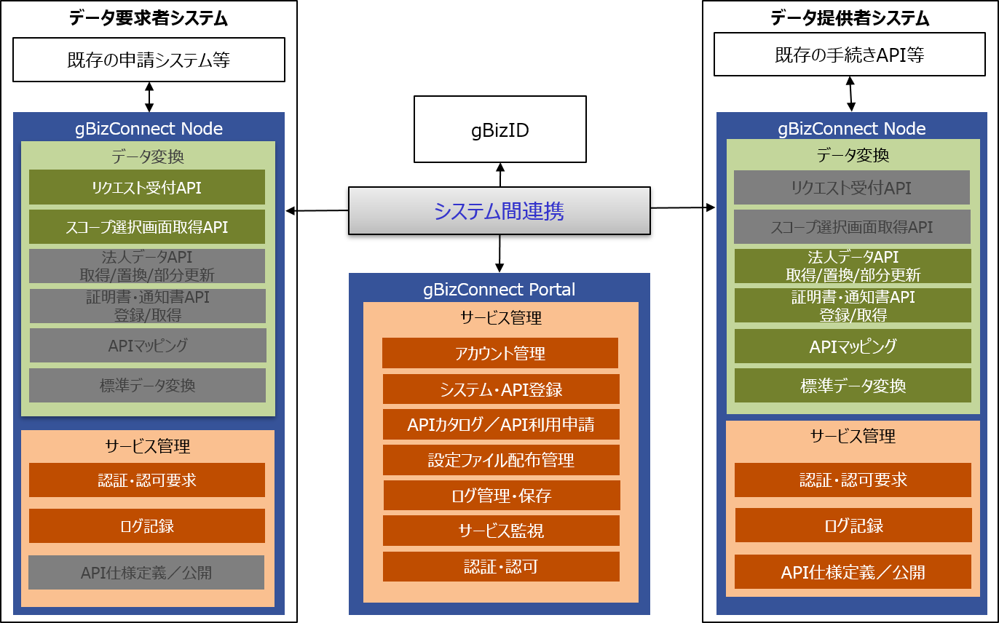
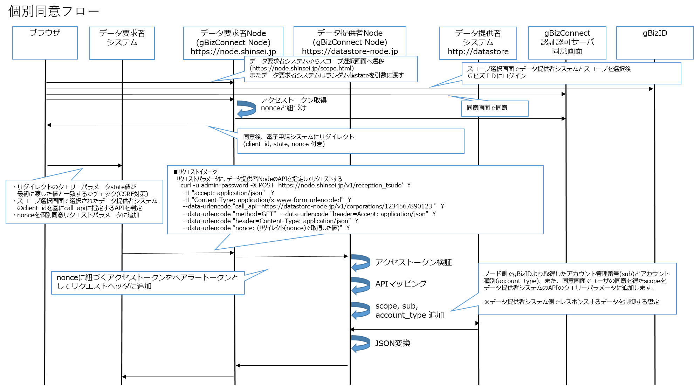
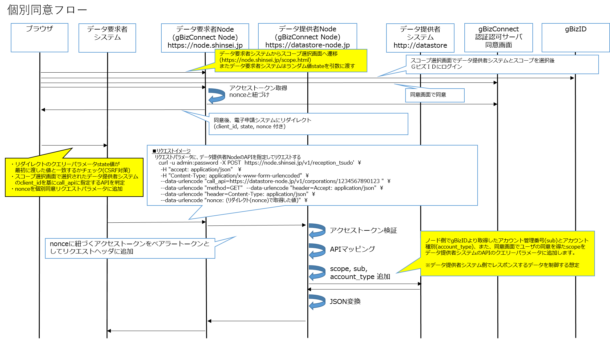
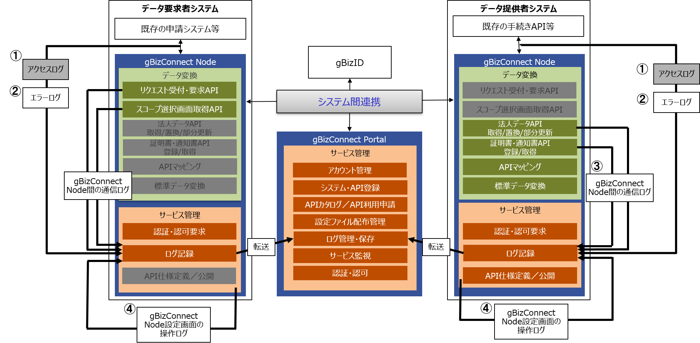

# gBizConnect Node 仕様書

## 1.	はじめに
本書はgBizConnect Nodeの仕様書です。
gBizConnectのシステム全体図を以下に示します。
<div align="center">


図１ gBizConnect　システム全体像  
※グレーアウトされた機能は、データ要求者またはデータ提供者の立場では使わないものを指します
</div>

### 1.1. 用語説明

|項番|用語|定義|
|:-|:-|:-|
|1|法人|一定の社会的活動を営む組織体で、法律により特に権利能力を認められたもの。gBizConnectにおいては、gBizIDのアカウントを有し、行政手続の主体となる。|
|2|法人データ|法人名、連絡先、認定情報、決算等、法人に関する一切のデータの総称。|
|3|法人標準データ|行政手続等で利用、取得される法人情報の項目を定義したデータ一式（構造体の名称）。|
|4|ワンスオンリー|特定の行政手続きを行った際に、申請で使用した情報を別の行政手続きで、再提出不要とし参照取得ができること。|
|5|gBizConnect|法人向け行政手続における添付書類撤廃・ワンスオンリーのためのプラットフォームとして、官民が保有する法人データを閲覧・取得して申請処理等に活用する仕組みの、具体サービス、システム名を指す。また分散化している法人データをgBizConnectを利用することで、法人標準データ形式で取得することができ、多対多のデータ利活用を促進する。gBizConnectは、gBizConnect Nodeと、gBizConnect Portalで構成される。|
|6|gBizConnect Portal|gBizConnectのサービスの提供、利用者へのサポート、その他gBizConnectの運営管理に必要な作業を含む、gBizConnect運営事務局が運営するサービス。|
|7|gBizConnect Node|利用者のシステムが、gBizConnectを利用している相手のシステムと連携するために、利用者自身のシステムに導入するソフトウエア。gBizConnect Node間でPeer to Peerのデータ連携を実現する。|
|8|gBizConnect運営事務局|gBizConnect Portalの稼働管理、運用及びgBizConnect Nodeの更新等、gBizConnectの運営を行う組織。|
|9|データ要求システム|gBizConnectを介して法人データを取得する側のシステムを指す。データ提供システムから法人データを取得し、申請手続きを容易にする。データ要求システムとデータ提供システムは概念的なものであり、一つのシステムが両方であったり状況によってどちらにもなりえたりする。|
|10|データ提供システム|gBizConnectを介して法人データを提供する側のシステムを指す。各法人に関する法人データを蓄積・保存し、APIを介して法人データをデータ要求システムに連携する。データ要求システムとデータ提供システムは概念的なものであり、一つのシステムが両方であったり状況によってどちらにもなりえたりする。|
|11|データ要求者|データ要求ステムを管理、運用し、gBizConnectを利用する組織。|
|12|データ提供者|データ提供システムを管理、運用し、gBizConnectを利用する組織。|
|13|データ要求システムNode|データ要求者が導入したgBizConnect Nodeを本文書では左記の名称で記載する。|
|14|データ提供システムNode|データ提供者が導入したgBizConnect Nodeを本文書では左記の名称で記載する。|
|15|gBizID|法人向けの１つのアカウントで複数の行政サービスにアクセスできる認証の仕組みの具体なサービス、システム名称。|
|16|スコープ|各データにスコープが定義されており、データ要求システムはスコープを指定することで取得するデータの範囲を指定することが出来る。|
|17|事前同意|行政手続等で、データ要求者が、データ提供者から法人データを取得する前に必要な同意。当該手続以外の目的でデータが利用されることに対して、事前に同意しておくことで、データを取得する度に同意を得ることが不要となる。|
|18|都度同意|行政手続等で、データ要求者が、データ提供者から法人データを取得する際に必要な同意。タイミングは法人データを取得する度に実施し、法人データのスコープも合わせて、その都度同意する必要がある。またデータ連携を実施する際は、gBizIDによるログイン認証を行う必要がある。|
|19|システム間連携|複数の独立したシステム間をgBizConnectNodeを介して、ないし独自の方法でデータの受け渡しが可能な経路が確立されていること。|

## 2. gBizConnect Node 機能詳細
### 2.1. APIを使用したデータ連携のイメージ
gBizConnect Node APIを使用してgBizConnectに参加しているシステム間で法人データ等の連携を行う際のイメージを示します。gBizConnectでは、データ連携を行う際に事業者自身の同意（事前同意と都度同意）に基づき開示制御を行う考え方があります。データ連携時の事前同意と都度同意のフローのイメージを示します。

<br>
<br>

<div align="center">


　図2.1-1 事前同意のフローのイメージ
</div>
<br>
<div align="center">


　図2.1-2 都度同意のフローのイメージ（事前同意のフローとの差異を黄色吹出に記載）
</div>
<br>

### 2.2. API一覧  
gBizConnect NodeのAPIを下表に示します。なお、各APIの詳細は[Swagger UI](./gBizConnectNodeAPI.html)を参照してください。  

|種類|API名称|概要|
|:-|:-|:-|
|受付・要求API|事前同意リクエスト受付・要求API|事前同意のあるデータ提供システムのAPIを呼び出します。|
||都度同意リクエスト受付・要求API|都度同意でユーザの同意を得たスコープでデータ提供システムのAPIを呼び出します。|
|法人データAPI|法人番号一覧取得|法人番号の一覧を取得します。|
||法人データ取得|法人番号で指定された法人の法人データを取得します。|
||法人データ置換|法人番号で指定された法人の法人データを置換します。|
||法人データ部分更新|法人番号で指定された法人の法人データを部分的に更新します。|
|証明書・通知書等API|証明書・通知書等番号一覧取得|法人番号で指定された法人の証明書・通知書等の通知番号一覧を取得します。|
||証明書・通知書等登録|法人番号で指定された法人の証明書・通知書等を登録します。|
||証明書・通知書等取得|法人番号と通知番号で指定された証明書・通知書等を取得します。|
|スコープ選択画面API|スコープ選択画面取得|都度同意のスコープ選択画面を返します。|  
|DB連携API|DB連携|パラメータ(法人番号,個人Gビズ内部ID)と、GビズIDで認証した情報との同一性を確認し、一致しない場合は認証のエラーを返却します。|

**各APIの説明**

* 受付・要求API：データ要求システムNodeが持つAPI  
データ要求システムから呼び出され、データ提供システムNodeを呼び出します。  
パラメータとして、データ提供システムNodeを一意に識別するクライアントID、API(法人データAPI/証明書・通知書等API)、スコープを渡すことで、法人データを取得できます。  
受付・要求APIはTLS通信とBasic認証で保護されています。    
API保護のため認証認可処理を行います。    

* 法人データAPI、証明書・通知書等API：データ提供システムNodeが持つAPI  
データ要求システムNodeから呼び出され、データ提供システムのAPIを呼び出します。  
データ提供システムNodeの持つAPIマッピングの設定にしたがってAPIを変換し、データ提供システムのAPIを呼び出します。  
法人データAPI、証明書・通知書等APIはTLS通信とベアラートークンで保護されています。  
データ提供システムのAPIが必要です。あらかじめ新規作成したAPIまたは既存のAPIをマッピング設定する必要があります。  
APIの呼び出しのアクセス制御処理を行います。  
都度同意時、データ提供システムAPIの呼び出し時にgBizIDのsub（アカウント管理番号）とaccount_type（アカウント種別）をクエリーパラメータに追加します。  
データ提供システムのAPIへのリクエストのJSONとレスポンスのJSONに対して、設定にしたがって、JSONの変換を行います。  

* 都度同意スコープ選択画面表示API：スコープ選択画面を表示するAPI   
都度同意でユーザが法人データを取得するデータ提供システムとスコープを選択する画面をレスポンスします。
都度同意スコープ選択画面表示APIは、ユーザがデータ提供システムとスコープを選択し、gBizIDにログインし、データ提供システムとスコープについての同意を得た後、データ要求システムにリダイレクトします。    
データ要求システムではリダイレクトのクエリーパラメータのstate値のチェックをします。  
データ要求システムではリダイレクトのクエリーパラメータnonce値を受付・要求APIに渡します。  

### 2.3. APIマッピング  
gBizConnectではシステム間連携する際、データ提供システムNodeでは、Node設定ファイルのAPIマッピングにしたがってリクエストを変換しデータ提供システムのAPIを呼び出します。  
そのため、データ要求システムNodeから呼び出される、データ提供者システムNodeのAPIを、データ提供者システムのAPIへ変換するAPIマッピングをしておく必要があります。

APIマッピングの設定方法は、
[gBizConnect Node 導入マニュアル](./gBizConnectNode_Manual.md)
を参照してください。

### 2.4.標準データマッピング機能
#### 2.4.1	JSON変換   

gBizConnect Nodeは、受付・要求APIのパラメータmethodの値に応じて、GETの場合は、導入システムのAPIのレスポンスのJSON、POST、PUT、PATCHの場合は、リクエストのbodyパラメータのJSONの構造を設定にしたがって変換することができます。JSON変換を使用することで、導入システムのJSONの構造を知ることなく、gBizConnectの標準データJSONでデータ連携を行えます。  
JSON変換ではインプットとなるJSONとアウトプットとなるJSONのキー同士を対応付けることで、JSONの構造を変換します。JSONの値は変更しません。JSON変換の設定はAPIごとに設定できます。  

JSON変換の設定方法は、
[gBizConnect Node 導入マニュアル](./gBizConnectNode_Manual.md)
を参照してください。  

#### 2.4.2 配列変換

配列変換では、JSONの特定のキーの値だけを集めた配列に変換することができます。
配列変換の設定はAPIごとに設定できます。

配列変換の設定方法は、
[gBizConnect Node 導入マニュアル](./gBizConnectNode_Manual.md)
を参照してください。

### 2.5. 認証認可要求  
データ要求システムNodeはデータ提供システムNodeのAPIの呼び出し時に、以下の認証認可処理を行います。   


|対象|処理内容|
|:-|:-|
|データ要求システムNode|事前同意の場合<br>・OAuth 2.0 Client Credentials Grantを使用してgBizConnect Portalの認証認可サーバよりアクセストークン取得<br>都度同意の場合<br>・OpenID Connect Authorization Code Flowを使用して、スコープ選択画面、gBizIDへのログイン、gBizConnect Portal認証認可サーバの同意画面を経てgBizConnect Portal認証認可サーバよりアクセストークンを取得|
||アクセストークンをベアラートークンとしてデータ提供システムのgBizConnet NodeのAPI呼び出しのリクエストヘッダに追加|
|データ提供システムNode|ベアラートークンとして受け取ったアクセストークンをgBizConnect Portalの認証認可サーバにイントロスペクションリクエストし検証結果をチェック|
||アクセストークンのazpクレーム値がgBizConnect Portalで利用許可したシステムのクライアントIDと一致するかチェック|
||アクセストークンのaudクレーム値が自身のクライアントIDと一致するかチェック|
||呼び出されるAPIがgBizConnect Portalで利用許可したAPIと一致するかチェック|  

### 2.6.	ログ記録
(1)	ログの内容  
ログの出力対象は、「gBizConnect Nodeのアクセスログ」「エラーログ」「gBizConnect Node間の通信ログ」  
「gBizConnect Node設定画面の操作ログ」です。ログの通信イメージを以下に示します。

<div align="center">
  

図2.12-1 ログ通信イメージ
</div>

以下のディレクトリにログを出力します。  
　① アクセスログ：gBizConnect Nodeのインストールディレクトリ/edge-module/log/access.log  
　② エラーログ：gBizConnect Nodeのインストールディレクトリ/edge-module/log/error.log  
　③ gBizConnect Node間の通信ログ：gBizConnect Nodeのインストールディレクトリ/edge-module/log/error.log  
　④ gBizConnect Node設定画面の操作ログ：
gBizConnect Nodeのインストールディレクトリ/config-php-script/log/php_error.log

①アクセスログは以下の形式で出力します。
```
$remote_addr - $remote_user [$time_local] "$request" $status $body_bytes_sent "$http_referer" "$http_user_agent" "$http_x_forwarded_for"
```
アクセスログの項目と内容    

|項目|内容|
|:-|:-|
|$remote_addr|client address|
|$remote_user|user name supplied with the Basic authentication|
|$time_local|local time in the Common Log Format|
|$request|full original request line|
|$status|response status|
|$body_bytes_sent	|number of bytes sent to a client, not counting the response header|
|$http_referer|referrer
|$http_user_agent|user-agent|
|$http_x_forwarded_for|x-forwarded-for|

>出典元：http://nginx.org/en/docs/http/ngx_http_core_module.html#variables    

②エラーログは以下の形式で出力されます。

yyyy/MM/dd hh:mm:ss [ログレベル] pid#tid: message

>出典元：https://github.com/nginx/nginx/blob/master/src/core/ngx_log.c

③gBizConnect Node間の通信ログはエラーログに出力します。通信ログの内容は下表のとおりです。  

通信ログの項目と内容  

|項目|内容|
|:-|:-|
|システム部|yyyy/MM/dd hh:mm:ss [ログレベル] pid#tid: *1 js:|
|ログレベル|Info, Warn, Error|
|識別ID|gBizConnect Nodeの受付・要求APIでリクエストを受け付けてからレスポンスするまでの間にgBizConnect Node間でやり取りされた通信を識別するID|
|データ要求システムNodeクライアントID|自身がデータ要求システムNodeの場合、自身のクライアントID<br>自身がデータ提供システムNodeの場合、通信しているデータ要求システムNodeの持つクライアントID|
|データ提供システムNodeクライアントID|自身がデータ提供システムNodeの場合、自身のクライアントID<br>自身がデータ要求システムNodeの場合、通信しているデータ提供システムNodeの持つクライアントID|
|実行日時|yyyy/MM/dd HH:mm:ss.SSS<br>ログ出力の日時|
|リクエスト元ドメイン|<ホスト名>[:<ポート番号>]|
|リクエスト先ドメイン|<ホスト名>[:<ポート番号>]|
|リクエスト先URI|<スキーム名>://<ホスト名>[:<ポート番号>]<パス>|
|リクエストメソッド|GET, POST, PUT, PATCH|
|メッセージ|Succeeded in calling the Internal API.<br>（データ要求システムからデータ要求システムNodeへのリクエストが完了した際に出力されます。）|
||Called Authorization Server.<br>（データ要求/提供システムNodeからgBizConnect Portalの認証認可サーバへのリクエストを送る際に出力されます。）|
||Succeeded in calling Authorization Server.<br>（gBizConnect Portalの認証認可サーバからデータ要求/提供システムNodeへのリクエストが完了した際に出力されます。）|
||Called the External API.<br>（データ要求システムNodeからデータ提供システムNodeへのリクエストを送る際に出力されます。）|
||Succeeded in calling the External API.(request_time:[x.xxx]s)<br>[x.xxx]は一連のリクエスト開始から終了までの処理時間（秒）<br>（データ提供システムNodeからデータ要求システムNodeへのリクエストが完了した際に出力されます。）|
||Called the Internal API.<br>（データ要求システムNodeからデータ要求システムへのリクエストを送る際に出力されます。）|
|拡張|gBizConnect Portalの設定でログの出力項目が追加されます|  

④gBizConnect Node設定画面の操作ログの内容は下表のとおりです。  

設定画面の操作ログの項目と内容   

|項目|内容|
|:-|:-|
|実行日時|yyyy/MM/dd HH:mm:ss.SSS<br>ログ出力の日時|
|メッセージ|The data has been updated.<br>（config.jsonが正常に更新された場合）
||The file is not JSON format.<br>（config.jsonがJSON形式ではない場合）|
||The file or folder cannot be accessed.(Exception information:[【例外情報】])<br>（config.json読み込み時に異常が検出された場合）|

(2)	gBizConnect Portalへのログ転送  
gBizConnect Nodeは通信ログをgBizConnect Portalに転送します。転送の仕様は下表のとおりです。  

|項目|内容|
|:-|:-|
|転送間隔|1回/1日（td-agentのDockerコンテナ起動時に開始）|
|リトライ回数|3回（2分、4分、8分とリトライ間隔は広がる）|
|バックアップ|リトライ転送失敗時、転送に失敗したログをコンテナ内の下記ディレクトリに保存<br>/var/log/td-agent/ |

通信ログの転送に失敗した場合、リトライします。リトライ回数分失敗した場合、ログはバックアップディレクトリに保存されます。保存されたログは、バックアップディレクトリに保存されています。  

(3)	gBizConnect Portalでのログ参照  
gBizConnect Nodeの通信エラーの調査で、通信相手のgBizConnect Nodeの通信ログを参照する必要がある場合は、gBizConnect Portalで参照します。  
詳細は、メニュー画面のログ管理を参照してください。

### 2.7.	API仕様定義／公開
gBizConnect NodeはSwagger API仕様で記述されたgBizConnect Node API仕様を公開できるようにSwagger UIを使用します。  
Swagger UIでAPIを試行された際のテストデータはJSON Serverを使用してレスポンスします。  
gBizConnect Node API以外に導入システム独自のAPI仕様を追加できるようにSwagger Editorを使用します。   

#### 2.7.1.	API仕様定義  
gBizConnect Nodeの起動後、Swagger Editorに以下のURLでアクセスできます。  
`https://node.example.jp[:port]/swaggereditor/`  

#### 2.7.2.	API仕様公開
gBizConnect Nodeの起動後、Swagger UIに以下のURLでアクセスできます。  
`https://node.example.jp[:port]/swaggerui/`  

gBizConnect Nodeの起動後、JSON Serverに以下のURLでアクセスできます。   
`https://node.example.jp[:port]/jsonserver/`  

### 2.8. 流量制御  
gBizConnect Nodeは、利用許可したシステムごとに過剰なリクエストの受付防止が可能な流量制御をすることができます。流量制御は利用許可したシステムのIPアドレスを把握する必要があります。IPアドレスはアクセスログから確認が可能です。過剰なリクエストは遅延するかドロップするか選択できます。

流量制御の設定方法は、
[gBizConnect Node 導入マニュアル](./gBizConnectNode_Manual.md)
を参照してください。

### 2.9.	gBizConnect Node設定ファイルの反映  
gBizConnect Node設定ファイルをgBizConnect Nodeに反映させる画面です。  
gBizConnect Nodeの起動後、以下のURLでアクセスできます。  
`http://node.example.jp:8080/setting.php`  
gBizConnect Node設定画面は外部に公開しないでください。  


## 3.都度同意
### 3.1 都度同意
gBizConnectの都度同意は、法人データ等をシステムが取得する必要がある場合に、法人データ等をどのデータ提供システムからどの範囲（スコープ）で取得するかの選択と同意をユーザから得た上でデータ取得を行います。

gBizConnectの都度同意の詳細な説明、設定方法は、
[gBizConnect Node 導入マニュアル](./gBizConnectNode_Manual.md)

範囲（スコープ）の定義は、
[3.2. gBizConnectのスコープ](#jump)
を参照してください。

### 3.2. gBizConnectのスコープ  
gBizConnectでは、法人データの取得範囲をスコープで定義しています。gBizConnect Node APIのscopeパラメータを指定することで、法人データの必要な範囲だけを取得することができます。scopeパラメータを指定しない場合はすべてのスコープを指定したとみなします。  

|スコープ|説明|
|:-|:-|
|basic|法人申請基本情報|
|application|申請内容情報|
|finance|財務情報|
|officer_list|役員一覧情報|
|shareholder_list|主要株主情報|
|office_list|事業所一覧情報|
|list_of_professions|資格保有者一覧情報|
|certificate|証明書情報|

## 4. gBizConnect Node間の通信  
(1) TLS通信   
gBizConnect Node間のTLS通信は「SSL/TLS暗号設定ガイドライン」に記載されている高セキュリティ型の暗号スイートを設定しています。  
「SSL/TLS暗号設定ガイドライン」はIPAの下記URLに掲載されています。  
https://www.ipa.go.jp/security/vuln/ssl_crypt_config.html  


(2) エラーレスポンス  
gBizConnect Nodeの処理中にエラーが発生した場合、エラーコードはHTTP Statusコードで返却し、エラーメッセージはJSONで返却します。JSONの構造は次の通りです。  

|キー (１階層目)|キー (２階層目)|値|
|:-|:-|:-|
|"error"||-|
||"message"|"エラーメッセージ"|  

エラーレスポンス例  
```
HTTP/1.1 400 Bad Request
Content-Type: application/json; charset=utf-8

{"error":{"message":"Config file is not JSON"}}
```

エラーレスポンスのメッセージは「4.3.(3)各種コード②gBizConnect Node独自のエラーメッセージ」を参照してください。  

(3) 各種コード  
　①HTTPのメッセージ  

|ステータス|メッセージ|内容|
|:-|:-|:-|
|200|OK|正常終了|
|201|Created|正常終了（POST）|
|204|No Content|正常終了|
|400|Bad Request|リクエストに問題がある|
|401|Unauthorized|認証されていない|
|403|Forbidden|権限がない|
|404|Not Found|リソースが存在しない|
|500|Internal Server Error|サーバ側でエラーが発生|
|502|Bad Gateway|プロキシのエラー|
|503|Service Unavailable|サービスの利用不可|
|504|Gateway Timeout|プロキシのタイムアウト|

　②gBizConnect Node独自のエラーメッセージ  

|ステータス|メッセージ|発生原因|
|:-|:-|:-|
|500|Config file is not JSON.|	config.jsonがJSON形式のデータではない場合|
|500|Permission denied|	config.jsonに権限がない場合|
|500|No such file or directory|	config.jsonがない場合|
|400|No Request Body.|受付・要求APIへのリクエストにボディがない場合|
|400|This parameter[call_api] is missing.	|受付・要求APIへのリクエストのcall_apiパラメータがない場合|
|400|This parameter[method] is missing.|受付・要求APIへのリクエストのmethodパラメータがない場合|
|400|This header parameter[Content-Type] is missing.|受付・要求APIへのリクエストのheaderパラメータ(Content-Type)がない場合|
|400|This method[GET] does not require HTTP Request body.|受付・要求APIへのリクエストのmethodパラメータがGETの場合でbodyパラメータがある場合|
|400|This method[POST/PUT/PATCH] requires HTTP Request body.|受付・要求APIへのリクエストのmethodパラメータがGET以外の場合でbodyパラメータがない場合|
|400|This parameter[【不正なパラメータ※】] does not contain equals.|受付・要求APIへのリクエストのパラメータに"="がないものがある場合(※methodGET等)|
|400|This parameter[【不正なパラメータ※】] contains multiple equals.|受付・要求APIへのリクエストのパラメータに"="が2つ以上ある場合(※method==GET等)|
|400|This header parameter[【重複パラメータ名】] has multiple keys.|受付・要求APIへのリクエストに重複するヘッダーのパラメータ名がある場合|
|400|This parameter[【重複パラメータ名】] has multiple keys.|受付・要求APIへのリクエストに重複するパラメータ名がある場合|
|400|This parameter[call_api] must start with http or https.[【パラメータ値】]"|受付・要求APIへのリクエストのcall_apiパラメータがhttpかhttpsで始まらない場合|
|400|This header parameter[Content-Type] is not [application/json].|受付・要求APIへのリクエストのheaderパラメータ(Content-Type)がapplication/jsonではない場合|
|400|This parameter[body] is not JSON.|受付・要求APIへのリクエストのbodyパラメータがJSON形式のデータではない場合|
|400|Unable to get client_id of Destination Server.|データ提供システムNodeのclient_idが取得できない場合|
|4xx|Failed to call Authorization Server.|認証認可サーバへのリクエストでエラーが発生<br>・config.jsonのoauthの設定値が正しくない場合|
|5xx|Failed to call Authorization Server.|認証認可サーバへのリクエストでエラーが発生<br>・config.jsonのoauthの設定値が正しくない場合<br>・認証認可サーバが停止している場合|
|400|INVALID_CREDENTIALS: Invalid client credentials|config.jsonのclient_idの設定値が正しくない場合|
|400|Invalid client secret|config.jsonのclient_secretの設定値が正しくない場合|
|400|Invalid client credentials|gBizConnect Portalでシステムが廃止されている場合|
|400|Client not enabled to retrieve service account|	gBizConnect Portalのシステムの設定が異常な場合|
|4xx|Failed to call the External API.|受付・要求APIへのリクエストのcall_apiパラメータのURLへのリクエストエラーが起きた場合|
|5xx|Failed to call the External API.|受付・要求APIへのリクエストのcall_apiパラメータのURLへのリクエストエラーが起きた場合|
|403|Client ID does not match with aud. (aud: 【アクセストークンのaud】)|受付・要求APIへのリクエストのcall_apiパラメータのURLへのリクエストを受け付けたgBizConnect Nodeのclient_idとアクセストークンの宛先のclient_id（aud）が一致しない場合|
|403|Could not get Client ID from access token.|受付・要求APIへのリクエストのcall_apiパラメータのURLへのリクエストを受け付けたgBizConnect Nodeで、アクセストークンからリクエスト元のclient_idが取得できない場合|
|403|Unpermitted Client ID. (【データ要求システムのクライアントID】)|受付・要求APIへのリクエストのcall_apiパラメータのURLへのリクエストを受け付けたデータ提供システムNodeで、リクエスト元のデータ要求システムのAPI利用を1つも承認していない場合|
|403|Unpermitted URI. (【call_apiパラメータ,methodパラメータ】)|受付・要求APIへのリクエストのcall_apiパラメータのURLへのリクエストを受け付けたgBizConnect Nodeで、リクエスト元のシステムのcall_apiで指定されたAPIの利用を承認していない場合|
|500|This URI cannot do API mapping.(call_api:【call_api_uri】)|APIマッピングができない場合|

## 5.データ提供システムの準備

### 5.1.データ提供システムのＡＰＩ  
データ提供システムは、データ提供システムNodeから呼び出されるAPIを実装（新規作成するか既存のAPIを使用）する必要があります。  
実装するAPIの仕様はgBizConnect Node APIの法人データAPI、証明書・通知書等APIの仕様に準拠する必要があります。   
既存のAPIで使用できるものがある場合は、実装する必要はありません。   
RESTの設計原則に従ってAPIを実装してください。

APIを実装する場合の前提は以下の通りです。  

|項目|内容|
|:-|:-|
|プロトコル|httpsまたはhttp|
|リクエストのContent-Type（POST, PUT, PATCHの場合）|application/json; charset=utf-8|
|レスポンスのContent-Type（GET, POST, PUT, PATCHの場合）|application/json; charset=utf-8|
|API認証|可能([[5.3. gBizConnect Nodeとシステム間の認証機能](#jump)]を参照)|
|正常時のレスポンスステータスコード（GET, PUT, PATCHの場合）|200|
|正常時のレスポンスステータスコード（POSTの場合）|201|
|異常時のレスポンスステータスコード|400（Bad Request）、404（Not Found）|

都度同意リクエストの場合、データ提供システムNodeはデータ提供システムのAPIを呼び出す際に、クエリーパラメータにscope, sub, account_typeを追加します。

|クエリーパラメータ|説明|
|:-|:-|
|scope|都度同意でユーザが同意したスコープ<br>複数のスコープがある場合は半角スペース（%20）区切り|
|sub|gBizIDのアカウント管理番号（内部的なIDを返却）|
|account_type|gBizIDのアカウント種別<br>（1：gBizIDエントリー、2：gBizIDプライム、3：gBizIDメンバー）|

データ提供システムのデータ管理でのgBizIDのアカウント管理番号subの使用有無とgBizIDのアカウント種別によって、データの取得範囲を制御します。  

<table>
  <tr>
    <th></th><th colspan="2">テーブル管理でのsubの使用有無</th>
    <th colspan="2">クエリーパラメータsub</th>
    <th colspan="3">クエリパラメータaccount_type</th><th colspan="2">データ取得範囲</th>
  </tr>
  <tr>
    <th>No.</th><th>使用あり</th><th>使用無し</th><th>あり</th><th>なし</th>
    <th>gBizIDエントリー</th><th>gBizIDプライム</th><th>gBizIDメンバー</th>
    <th>subに紐づく全て</th><th>指定した法人番号だけ</th>
  </tr>
  <tr>
    <td>1</td><td>○</td><td></td><td>○</td><td></td><td>○</td><td></td><td></td><td></td><td>○</td>
  </tr>
  <tr>
    <td>2</td><td>○</td><td></td><td>○</td><td></td><td></td><td>○</td><td></td><td>○</td><td></td>
  </tr>
  <tr>
    <td>3</td><td>○</td><td></td><td>○</td><td></td><td></td><td></td><td>○</td><td>○</td><td></td>
  </tr>
  <tr>
    <td>4</td><td>○</td><td></td><td></td><td>○</td><td>/</td><td>/</td><td>/</td><td></td><td>○</td>
  </tr>
  <tr>
    <td>5</td><td></td><td>○</td><td>/</td><td>/</td><td>/</td><td>/</td><td>/</td><td>○</td><td>○</td>
  </tr>
</table>

### 5.2. メタデータ

設定により、レスポンスにはメタデータが付与されます。
レスポンスのJSONは以下の構造になります。

|キー (１階層目)|キー (２階層目)|値|
|:-|:-|:-|
|"meta"||-|
||"source_client_id"|データ要求システムNodeのクライアントID|
||"desitination_client_id"|データ提供システムNodeのクライアントID|
||"system_name"|データ提供システムのシステム名|
||"scopes"|データ要求システムが指定したスコープリスト|
||"request_time"|ss.SSS<br>法人データ取得にかかった時間(s)|
||"timestamp"|yyyy/MM/dd HH:mm:ss.SSS<br>法人データ取得時刻|
|"data"||gBizConnect標準データ|

メタデータ付与の設定方法は、
[gBizConnect Node 導入マニュアル](./gBizConnectNode_Manual.md)
を参照してください。

### 5.3. gBizConnect Nodeとシステム間の認証機能

データ提供システムNodeからデータ提供システムにリクエストするときのHTTP認証として、
* Authorizationヘッダを用いた認証(Basic, Bearer)
* 独自ヘッダを用いたAPIキー認証

に対応しています。

gBizConnect Nodeとシステム間の認証機能の設定方法は、
[gBizConnect Node 導入マニュアル](./gBizConnectNode_Manual.md)
を参照してください。

### 5.4. データ提供システムNodeの名前解決機能  
gBizConnect Node設定ファイルにデータ提供システムNodeのクライアントIDとドメインを持っておき、データ要求システムからリクエストでクライアントIDと「Node APIのエンドポイントからドメインを除いた部分」をデータ要求システムで受け付けて、データ要求システムNodeでエンドポイントを組み立ててリクエストすることができます。  
ドメインやIPアドレスが変わった場合でも、クライアントIDをもとに名前解決をすることができます。

## 6. gBizConnect Node 設定ファイル  
(1) gBizConnect Node設定ファイル仕様  
gBizConnect Node設定ファイルは、認証認可、APIマッピング、標準データマッピング、ログ出力項目を設定するファイルです。設定内容はJSON形式で設定します。gBizConnect Portalからダウンロードします。gBizConnect Portalで自動設定される項目と、手動設定する項目があります。gBizConnect Node設定ファイルの仕様について記載します。  

|キー (１階層目)|キー (２階層目)|キー (３階層目)|値|自動設定(*1)|手動設定(*2)|内容|
|:-|:-|:-|:-|:-|:-|:-|
|client_id|||string|○|変更禁止|システムのgBizConnect NodeのOAuth 2.0のクライアントIDです。認証認可処理で使用します。|
|client_secret|||string|○|変更禁止|システムのgBizConnect NodeのOAuth 2.0のクライアントシークレットです。<br>認証認可処理で使用します。|
|system_name|||string|○|変更禁止|システム名です。|
|call_system_api_headers|||object|-|○|データ提供システムNodekからデータ提供システムにリクエストするときのHTTP認証の情報を設定します。<br>以下のキーを持つobjectです。|
||authorization||string|-|○|Authorizationヘッダを用いた認証(Basic, Bearer)で使用する値を設定します。|
||api_key||string|-|○|独自ヘッダを用いたAPIキー認証で使用する値を設定します。|
|meta|||object|-|○|メタデータ付与の情報を設定します。<br>以下のキーと値を持ちます。|
||add_flag||boolean|-|○|レスポンスのJSONにメタデータを付与するかしないかを設定します。<br>true: メタデータを付与する<br>false: メタデータを付与しない|
|authorized_client_list|||array|○|変更禁止|データ要求システムNodeのクライアントIDと、その他システムに対し利用を承認したデータ提供システムNodeのAPIの情報です。以下のキーを持つobjectの配列です。|
||client_id||string|○|変更禁止|API利用を承認されたデータ要求システムNode のOAuth 2.0のクライアントIDです。|
||endpoint||array|○|変更禁止|上記client_idを持つデータ要求システムNodeに対して利用を承認したデータ提供システムNodeのAPIのエンドポイントの情報です。以下のキーを持つobjectの配列です。|
|||uri|string|○|変更禁止|データ提供システムNodeのAPIのエンドポイントのパスです。|
|||method|string|○|変更禁止|データ提供システムNodeのエンドポイントのAPIのメソッドです。|
|internal_api_mappings|||array|-|○|APIマッピングの情報を持ちます。データ提供システムのAPIのエンドポイントはsystem_api_addr + system_api_uri_replaceで生成されるURLとなります。<br>以下のキーを持つobjectの配列です。|
||system_api_addr||string|-|○|データ提供システムのAPIのURLから「<スキーム名>://<ホスト名>[:<ポート番号>]」を設定します。<br>・<スキーム名>は「https://」または「http://」のみ設定できます。<br>・ [:<ポート番号>]は各スキームのデフォルトポートの場合省略可能です。|
||system_api_uri_extract||string|-|○|データ提供システムNodeNodeのAPIのエンドポイントのパスを設定します。正規表現を使用して下さい。先頭に^,末尾に $を使用しないと予期せぬマッピングがされる可能性があります。|
||system_api_uri_replace||string|-|○|データ提供システムのAPIのエンドポイントのパスを設定します。上記のsystem_api_uri_extractで、()でグループ化した文字列とマッチした部分を、$n(n>0)で参照し、埋め込むことができます。|
|json_converts|||array|-|○|標準データマッピング機能の情報を設定します。<br>以下のキーを持つobjectの配列です。|
||json_convert_get_flag||boolean|-|○|導入システムのAPIからレスポンスされたJSONのキーをgBizConnectの標準データJSONのキーに変換するかしないかを設定します。<br>true：JSON変換する<br>false：JSON変換しない|
||json_convert_set_flag||boolean|-|○|導入システムのAPIを呼び出す前にgBizConnectの標準データJSONのキーを導入システムのJSONのキーに変換するかしないかを設定します。<br>true：JSON変換する<br>false：JSON変換しない|
||array_convert_get_flag||boolean|-|○|導入システムのAPIからレスポンスされたJSONのキーを配列に変換するかしないかを設定します。<br>true：配列変換する<br>false：配列変換しない|
||json_convert_uri||string|-|○|JSON変換を実行するデータ提供システムNodeのAPIのエンドポイントのパスを設定します。正規表現を使用して下さい。先頭に^,末尾に $を使用しないと予期せぬJSON変換が行われる可能性があります。|
||json_convert_method||string|-|○|JSON変換を実行するデータ提供システムNodeのAPIのエンドポイントのメソッドを設定します。|
||json_convert_rule||string|-|○|JSON変換で実行するルール名を設定します。json_convert_rulesのキーを一つ指定します。|
|json_convert_rules|||array|-|○	|gBizConnectの標準データJSONと導入システムのJSONのキーのマッピングを設定します。<br>以下のキーを持つobjectの配列です。|
||JSON変換ルール名（手動設定）||object|-|○|任意のユニークな名前を設定します。<br>以下のキーを持つobjectの配列です。|
|||response|string|-|○|gBizConnectの標準データJSONのキーを設定します。<br>ObjectがさらにObjectを持つような入れ子の場合、キーは階層を設定できます。<br>{"A":{"B":{"C":"D"}}}の"C"は"A.B.C"と設定します。|
|||datastore|string|-|○|導入システムのJSONのキーを設定します。<br>ObjectがさらにObjectを持つような入れ子の場合、キーは階層を設定できます。<br>{"A":{"B":{"C":"D"}}}の"C"は"A.B.C"と設定します。|
|array_convert_rules|||array|-|○	|導入システムのJSONのキーを配列に変換するルールを設定します。<br>以下のキーを持つobjectの配列です。|
||配列変換ルール名（手動設定）||object|-|○|任意のユニークな名前を設定します。<br>以下のキーを持つobjectの配列です。|
|||datastore|string|-|○|導入システムのJSONのキーを設定します。<br>ObjectがさらにObjectを持つような入れ子の場合、キーは階層を設定できます。<br>{"A":{"B":{"C":"D"}}}の"C"は"A.B.C"と設定します。|
|authorized_server_list|||array|○|変更禁止|データ要求システムNodeが利用するデータ提供システムNode APIのエンドポイントのホスト名とクライアントIDの情報を持ちます。<br>gBizConnect Portalでデータ提供システムのAPIの利用を承認されている場合に設定されます。<br>以下のキーを持つobjectの配列です。|
||domain||string|○|変更禁止|データ要求システムNodeで利用する、データ提供システムNode のAPIのエンドポイントのホスト名です。|
||client_id||string|○|変更禁止|データ要求システムNodeで利用する、データ提供システムNodeのクライアントIDです。|
||name||string|○|変更禁止|データ要求システムNodeで利用する、データ提供システムNodeのシステム名です。|
||scopes||array|○|変更禁止|データ要求システムNodeで利用する、データ提供システムNodeの持つスコープ一覧です。<br>以下のキーを持つobjectの配列です。|
|||name|string|○|変更禁止|gBizConnectのスコープの説明です。|
|||value|string|○|変更禁止|gBizConnectのスコープです。|
|log_nginx_variables|||array|○|変更禁止|ログ出力項目です。<br>以下のキーを持つobjectの配列です。|
||log_nginx_variable||string|○|変更禁止|設定値はnginx内で使用できる変数名です。|
||flag||boolean|○|変更禁止|log_nginx_variableに設定した項目のログ出力有無を持ちます。<br>true：ログ出力あり<br>false：ログ出力なし|
|oauth|||object|○|変更禁止|OAuth 2.0のエンドポイントの設定です。<br>以下のキーを持つobjectです。|
||oauth_token_introspect_endpoint||string|○|変更禁止|OAuth 2.0のイントロスペクションエンドポイントです。<br>認証認可処理で使用します。|
||oauth_token_endpoint||string|○|変更禁止|OAuth 2.0のトークンエンドポイントです。<br>認証認可処理で使用します。|
||discovery||string|○|変更禁止|OpenID Connect Discovery 1.0のOpenID Provider Configuration RequestのURLです。<br>認証認可処理で使用します。|
|openid_connect|||object|-|○|OpenID Connectの設定です<br>以下のキーを持つobjectです。|
||no_consent_url||string|-|○|同意画面でユーザが同意しなかった場合にリダイレクトする導入システムのURLです。<br>認証認可処理で使用します。|
||post_authorized_url||string|-|○|同意画面でユーザが同意した場合にリダイレクトする導入システムのURLです。<br>認証認可処理で使用します。|
||redirect_uri||string|-|○|OpenID Connect 1.0のリダイレクトURLです。以下のURLを指定します。<br>`https://node.example.jp[:port]/v1/auth/redirect_uri` (*3)<br>認証認可処理で使用します。|  
||scope_authenticate_url||string|-|○|スコープ選択画面で法人データを自動取得するURLです。以下のURLを指定します。<br>`https://node.example.jp[:port]/v1/auth` (*3)<br>認証認可処理で使用します。|
||scope_no_authenticate_url||string|-|○|スコープ選択画面で法人データを自動取得しない場合にリダイレクトする導入システムのURLです。<br>認証認可処理で使用します。|

(* 1)自動設定が○の項目はgBizConnect PortalからダウンロードしたgBizConnect Node設定ファイルに設定されています。設定値を変更しないでください。  
(* 2)手動設定が○の項目はgBizConnect PortalからダウンロードしたgBizConnect Node設定ファイルに設定されています。gBizConnect Portalで設定が必要です。  
(* 3)「node.example.jp[:port]」の意味は以下の通りです。  
「node.example.jp」はgBizConnect Nodeを導入するサーバのホスト名です。  
「[:port]」はDockerコンテナedge-moduleの公開ポート番号で443の場合省略可能です。  
指定例：node.example.jp、node.example.jp:443


(2)	gBizConnect Node設定ファイルサンプル  
gBizConnect Node設定ファイルのサンプルを示します。  

* データ要求システムNode
```json
{
    "client_id":"xxxxxxxxxxxxx-xxxx-xxxx-xxxxxxxxxxxx",
    "client_secret":"wwwwwwwwwwwww-wwww-wwww-wwwwwwwwwwww",
    "authorized_server_list":[
        {
            "domain":"https://edge.datastore.jp",
            "client_id":"yyyyyyyyyyyyy-yyyy-yyyy-yyyyyyyyyyyy"
        }
    ],
    "log_nginx_variables":[
        {
            "log_nginx_variable":"content_type",
            "flag":false
        },
        {
            "log_nginx_variable":"nginx_version",
            "flag":false
        }
    ],
    "oauth":{
        "oauth_token_introspect_endpoint": "https://xxx.go.jp/auth/realms/gbizconnect/protocol/openid-connect/token/introspect",
        "oauth_token_endpoint": "https://xxx.go.jp/auth/realms/gbizconnect/protocol/openid-connect/token",
        "discovery":"https://xxx.go.jp/auth/realms/gbizconnect/.well-known/openid-configuration"
    },
    "openid_connect":{
        "no_consent_url":"https://app.denshi.jp/no_consent",
        "post_authorized_url":"https://app.denshi.jp/post_authorized",
        "redirect_uri": "https://node.denshi.jp/v1/auth/redirect_uri"
    }
}
```


 
## 7. gBizConnect標準データ項目   

gBizConnectに参加するシステム間でのデータ連携で受け渡されるデータのフォーマットはJSONです。gBizConnectでは標準データとして以下のデータ項目をJSONで表現します。  
標準データのスコープとして基本情報、申請情報、財務情報、証明書情報を定義しています。  

### 7.1.	標準データのスコープとデータ項目  
　2019年12月時点の標準データ項目であり、今後変更する可能性があります。  

* 基本情報  

データ項目(申請書基本)  

|ブロック名|項目<br>No.|項目名|区分|説明|形式|記入例|
|:-|:-|:-|:-|:-|:-|:-|
|宛先|1-1|法人番号|◎|法人に割り当てられる一意の番号（13桁）|文字列（半角数字）|1234567891011|
||1-2|法人名|○|法人の商号又は名称|文字列|○○株式会社|
||1-3|法人名(カナ）|○|法人の商号又は名称のカナ表記|文字列（全角カナ）|マルマルカブシキガイシャ|
||1-4|本社所在地||法人の住所の全文表記（都道府県から記入し、丁目以下は半角数字とハイフンで記入）|文字列|東京都千代田区霞が関1-3-1|
||1-5|本社建物名||法人の住所の建物名|文字列|霞ヶ関○○ビル|
||1-6|事業所名||法人に関連する、支店などの名称|文字列|○○株式会社神奈川支社|
||1-7|事業所所在地||法人に関連する、支店などの住所の全文表記（都道府県から記入し、丁目以下は半角数字とハイフンで記入）|文字列|神奈川県川崎市中原区小杉町1-1-1|
||1-8|事業所建物名||法人に関連する、支店などの建物名|文字列|武蔵小杉○○ビル|
||1-9|事業所郵便番号||法人に関連する、支店などの郵便番号（ハイフンなしの７桁）|文字列（半角数字）|1234567|
||1-10|申請日||申請書の提出日（西暦年月日とし、半角数字をハイフンでつなぐ）|日付|2010-01-01|
|内容|2-1|設立日|○|法人が設立された日（西暦年月日とし、半角数字をハイフンでつなぐ）|日付|2010-01-01|
||2-2|資本金|○|法人の資本金|文字列（半角数字）|10,000,000|
||2-3|従業員数|○|直前決算期の法人の従業員数|文字列（半角数字）|500|
||2-4|正社員数|○|直前決算期の法人の正社員数|文字列（半角数字）|400|
|連絡先|3-1|担当者部署||担当部署名|文字列|「事例サンプル」シートを参照|
||3-2|担当者役職||担当者の役職|文字列|「事例サンプル」シートを参照|
||3-3|担当者名(姓)	||担当者の姓|文字列|「事例サンプル」シートを参照|
||3-4|担当者名ヨミガナ(姓)	||担当者の姓の読み仮名|文字列（全角カナ）|「事例サンプル」シートを参照|
||3-5|担当者名(名)	||担当者の名|文字列|「事例サンプル」シートを参照|
||3-6|担当者名ヨミガナ(名)	||担当者の名の読み仮名|文字列（全角カナ）|「事例サンプル」シートを参照|
||3-7|電話番号||担当部署の電話番号（省略可能な市外局番にカッコをつけ、以降の番号はハイフンで繋げる）|文字列（半角英数字）|「事例サンプル」シートを参照|
||3-8|内線||担当部署の電話番号の内線番号|文字列（半角数字）|「事例サンプル」シートを参照|
||3-9|メールアドレス	||連絡先のメールアドレス|文字列（半角英数字）|「事例サンプル」シートを参照|
||3-10|住所||連絡先の住所の全文表記（都道府県から記入し、丁目以下は半角数字とハイフンで記入）|文字列|「事例サンプル」シートを参照|
||3-11|webフォーム||連絡先のWebフォーム|文字列（半角英数字）|「事例サンプル」シートを参照|
|発行元|4-1|法人番号|◎|法人に割り当てられる一意の番号（13桁）|文字列（半角数字）|1234567891011|
||4-2|法人名|○|法人の商号又は名称|文字列|○○株式会社|
||4-3|法人名(カナ）|○|法人の商号又は名称のカナ表記|文字列（全角カナ）|マルマルカブシキガイシャ|
||4-4|業種コード	||法人の業種をコードで表現したもの（日本標準産業分類の大分類で2桁）|文字列（半角数字）|01<br> (農業)|
||4-5|本社所在地||法人の住所の全文表記（都道府県から記入開始、丁目以下は半角数字とハイフンで記入）|文字列|東京都千代田区霞が関2-2-2|
||4-6|本社建物名||法人の住所の建物名|文字列|霞ヶ関○○ビル|
||4-7|事業所名||法人に関連する、支店などの名称|文字列|○○株式会社神奈川支社|
||4-8|事業所所在地||法人に関連する、支店などの住所の全文表記（都道府県から記入し、丁目以下は半角数字とハイフンで記入）|文字列|神奈川県川崎市中原区小杉町3-3-3|
||4-9|事業所建物名||法人に関連する、支店などの建物名|文字列|武蔵小杉○○ビル|
||4-10|事業所郵便番号||法人に関連する、支店などの郵便番号（ハイフンなしの７桁）|文字列（半角数字）|1234567|
||4-11|代表者役割||法人の代表者の役割・役職|文字列|代表取締役社長|
||4-12|代表者名(姓)|法人の代表者の姓|文字列|霞が関|
||4-13|代表者名(名)||法人の代表者の名|文字列|太郎|

* 申請情報  

データ項目（申請内容）  

|ブロック名|項目<br>No.|項目名|区分|説明|形式|記入例|
|:-|:-|:-|:-|:-|:-|:-|
|内容|1-1|名称|○|申請内容のタイトル|文字列|IT導入補助金の申請|
||1-2|概要|○|申請内容の概要|文字列|○○の情報を一元管理するためのクラウドシステムの導入|
||1-3|内容|○|申請内容|文字列|現在の○○業務に関するデータはエクセルファイルに記載され、各部署毎に..|
||1-4|更新年月日|○|申請内容の更新日（西暦年月日とし、半角数字をハイフンでつなぐ）|日付|2019-01-01|  

* 財務情報  

データ項目（財務情報）  

|ブロック名|項目<br>No.|項目名|区分|説明|形式|記入例|
|:-|:-|:-|:-|:-|:-|:-|
|内容|1-1|決算年月日|○|決算日（西暦年月日とし、半角数字をハイフンでつなぐ）|日付|2020-01-01|
||1-2|事業期間開始日|○|決算を行った事業期間の開始日（西暦年月日とし、半角数字をハイフンでつなぐ）|日付|2010-01-01|
||1-3|事業期間終了日|○|決算を行った事業期間の終了日（西暦年月日とし、半角数字をハイフンでつなぐ）|日付|2030-03-03|
||1-4|期末従業員数|○|常時雇用する従業員の期末における人数|文字列（半角数字）|500|
||1-5|資産合計|○|流動資産、固定資産、繰延資産の合計|文字列（半角数字）||
||1-5-1|流動資産合計|○|流動資産の合計|文字列（半角数字）||	　
||1-5-1-1|現金及び預金|○|現金と預金（当座、定期）の合計|文字列（半角数字）||
||1-5-1-2|受取手形|○|売上債権のうち手形として保有している額|文字列（半角数字）||
||1-5-1-3|売掛金|○|売上債権のうち手形として保有していない額|文字列（半角数字）||
||1-5-1-4|有価証券|○|有価証券の合計額|文字列（半角数字）||
||1-5-1-5|棚卸資産|○|販売目的で一時的に保有する商品・製品・原材料・仕掛品の合計額|文字列（半角数字）||
||1-5-1-6|その他流動資産合計|○|前払金、短期貸付金、貸倒引当金などの流動資産の合計|文字列（半角数字）||
||1-5-1-6-1|前払金|○|商品を受け取る前に代金を先払いした額|文字列（半角数字）||
||1-5-1-6-2|短期貸付金|○|決算日の翌日から起算して1年以内に回収される貸付金の合計額|文字列（半角数字）||
||1-5-1-6-3|貸倒引当金|○|貸倒損失になるかもしれない額|文字列（半角数字）||
||1-5-2|固定資産合計|○|固定資産の合計|文字列（半角数字）||
||1-5-2-1|有形固定資産合計|○|建物、機械装置、土地などの有形固定資産の合計|文字列（半角数字）||
||1-5-2-1-1|土地|○|土地の合計額|文字列（半角数字）||
||1-5-2-2|無形固定資産合計|○|ソフトウェア、のれんなどの無形固定資産の合計|文字列（半角数字）||
||1-5-2-3|その他固定資産合計|○|投資、長期貸付金、長期前払費用、関係会社株式などの固定資産の合計|文字列（半角数字）||
||1-5-3|貸付金合計|○|長期貸付金と短期貸付金の合計|文字列（半角数字）||
||1-6|負債合計|○|流動負債、固定負債の合計|文字列（半角数字）||
||1-6-1|流動負債合計|○|流動負債の合計|文字列（半角数字）||
||1-6-1-1|支払手形|○|営業取引によって生じた手形債務|文字列（半角数字）||
||1-6-1-2|買掛金|○|営業取引によって生じた未払金|文字列（半角数字）||
||1-6-1-3|短期借入金|○|借入金で１年以内に期限の到来するもの|文字列（半角数字）||
||1-6-1-4|その他流動負債合計|○|未払金、前受金、預り金などの合計|文字列（半角数字）||
||1-6-1-4-1|未払金|○|通常の取引に関連して発生した未払金|文字列（半角数字）||
||1-6-1-4-2|前受金|○|営業収益の前受額|文字列（半角数字）||
||1-6-1-4-3|預り金|○|後日預かった者又は第三者対して支払うべきもの|文字列（半角数字）||
||1-6-2|固定負債合計|○|固定負債の合計|文字列（半角数字）|
||1-6-2-1|長期借入金|○|到来期限が1年以上の借入金|文字列（半角数字）||
||1-7|純資産合計|○|資産から負債を引いた額|文字列（半角数字）||
||1-7-1|資本金|○|資本金|文字列（半角数字）||
||1-7-2|資本準備金|○|資本準備金|文字列（半角数字）||
||1-8|売上高|○|製品・商品等の売上高|文字列（半角数字）||
||1-9|売上原価|○|製品・商品等の原価|文字列（半角数字）|
||1-9-1|売上原価内減価償却費|○|製品・商品の製造に係る減価償却実施額|文字列（半角数字）||
||1-9-2|労務費|○|製造に関わる人件費・労務費|文字列（半角数字）||
||1-10|売上総利益|○|売上高から売上原価を引いた額|文字列（半角数字）|
||1-11|販売費及び一般管理費|○|販売費および一般管理費計|文字列（半角数字）||
||1-11-1|販管費内減価償却費|○|業に係る減価償却実施額|文字列（半角数字）||
||1-11-2|人件費|○|従業員給料、役員報酬などの合計|文字列（半角数字）|
||1-12|営業利益|○|売上総利益から販売費および一般管理費を引いた額|文字列（半角数字）||
||1-13|営業外収益|○|主に金融活動に伴う収益|文字列（半角数字）||
||1-14|営業外費用|○|主に金融活動に伴う費用|文字列（半角数字）||
||1-15|経常利益|○|本業と本業以外の損益の合計|文字列（半角数字）||
||1-16|特別利益|○|資産売却益、為替差益等|文字列（半角数字）||
||1-17|特別損失|○|資産評価損・処分損、為替差損等|文字列（半角数字）||
||1-18|税引前当期純利益|○|税引前の当期利益額	|文字列（半角数字）||
||1-19|当期純利益|○|税引前当期純利益から法人税等を引いた額|文字列（半角数字）||  

* 証明書情報  
データ項目（証明書）

|ブロック名|項目<br>No.|項目名|区分|説明|形式|記入例|
|:-|:-|:-|:-|:-|:-|:-|
|宛先|1-1|法人番号|◎|法人に割り当てられる一意の番号（13桁）|文字列（半角数字）|1234567891011|
||1-2|商号又は名称|○|法人の商号又は名称|文字列|○○株式会社|
||1-3|商号又は名称(カナ）|○|法人の商号又は名称のカナ表記|文字列（全角カナ）|マルマルカブシキガイシャ|
||1-6|本社住所||法人の住所の全文表記（都道府県から記入開始、丁目以下は半角数字とハイフンで記入）|文字列|東京都千代田区霞が関1-3-1|
||1-7|本社建物名||法人の所在地の建物名|文字列|霞ヶ関○○ビル|
||1-8|事業所名||法人に関連する、支店などの名称|文字列|○○株式会社神奈川支社|
||1-9|事業所住所||法人に関連する、支店などの住所の全文表記（都道府県から記入開始、丁目以下は半角数字とハイフンで記入）|文字列|神奈川県川崎市中原区小杉町1-1-1|
||1-10|事業所建物名||法人に関連する、支店などの建物名|文字列|武蔵小杉○○ビル|
||1-11|代表者役割||法人の代表者の役割|文字列|代表取締役社長|
||1-12|代表者名(姓)||法人の代表者の姓|文字列|霞が関|
||1-13|代表者名(名)||法人の代表者の名|文字列|太郎|
|内容|2-1|公表組織の法人番号の種類|○|公表組織の種別を明示したもの|?|?|
||2-2|発行組織の名称|○|発行組織の名称|文字列|経済産業局|
||2-3|公表組織の法人番号|○|公表組織の法人番号（13桁）|文字列（半角数字）|1111111111111|
||2-4|公表組織の名称|○|公表組織の名称|文字列|経済産業省|
||2-5|担当者部署|○|担当者部署|文字列|○○部|
||2-6|担当者役職|○|担当者役職|文字列|次長|
||2-7|担当者名(姓)|○|担当者の姓|文字列|虎ノ門|
||2-8|担当者名(名)	||担当者の名|文字列|花子|
||2-9|電話番号|○|電話番号（省略可能な市外局番にカッコをつけ、以降の番号はハイフンで繋げる）|文字列（半角英数字）|(03)3501-151|
||2-10|内線|○|内線番号|文字列（半角数字）|02|
||2-11|メールアドレス|○|メールアドレス|文字列（半角英数字）|chiyoda-jiro26@xxx.co.jp|
||2-12|証明日|○|証明の発行日（西暦年月日とし、半角数字をハイフンでつなぐ）|日付|2010-01-01|
||2-13|ID|○|証明書のID|文字列（半角英数字）||
||2-14|証明書名|○|証明の名称|文字列||
||2-15|対象|○|証明の対象|文字列||
||2-16|値|○|証明する対象に数値がある場合に記入|文字列（半角数字）||
||2-17|証明開始日|○|証明の開始日（西暦年月日とし、半角数字をハイフンでつなぐ）|日付|2000-02-02|
||2-18|証明終了日|○|証明の終了日（西暦年月日とし、半角数字をハイフンでつなぐ）|日付|2000-03-03|
||2-19|備考|○|証明に関する備考|文字列||	　
|連絡先|3-1|担当者部署||担当部署名|文字列|広報部|
||3-2|担当者役職||担当者の役職|文字列|係長|
||3-3|担当者名(姓)||担当者の姓|文字列|霞ヶ関|
||3-4|担当者名ヨミガナ(姓)||担当者の姓の読み仮名|文字列（全角カナ）|カスミガセキ|
||3-5|担当者名(名)||担当者の名|文字列|太郎|
||3-6|担当者名ヨミガナ(名)||担当者の名の読み仮名|文字列（全角カナ）|タロウ|
||3-7|電話番号||担当部署の電話番号（省略可能な市外局番にカッコをつけ、以降の番号はハイフンで繋げる）|文字列（半角英数字）|(03)3501-151|
||3-8|内線||担当部署の電話番号の内線番号|文字列（半角数字）|01|
||3-9|メールアドレス||連絡先のメールアドレス|文字列（半角英数字）|chiyoda-jiro26@xxx.co.jp|
||3-10|住所||連絡先の住所の全文表記（都道府県から記入し、丁目以下は半角数字とハイフンで記入）|文字列|東京都千代田区霞が関1-3-1|
||3-11|webフォーム||連絡先のWebフォーム|文字列（半角英数字）|http://xxx.yyy.co.jp|
|発行元|4-1|法人番号|○|法人に割り当てられる一意の番号（13桁）|文字列（半角数字）|1313131313131|
||4-2|商号又は名称|○|法人の商号又は名称|文字列|□□株式会社|
||4-3|商号又は名称(カナ）|○|法人の商号又は名称のカナ表記|文字列（全角カナ）|シカクシカクカブシキガイシャ|
||4-6|本社住所||法人の住所の全文表記（都道府県から記入開始、丁目以下は半角数字とハイフンで記入）|文字列|東京都千代田区霞が関1-3-1|
||4-7|本社建物名||法人の住所の建物名|文字列|霞ヶ関□□ビル|
||4-8|事業所名||法人に関連する、支店などの名称|文字列|□□株式会社虎ノ門支社|
||4-9|事業所住所||法人に関連する、支店などの住所の全文表記（都道府県から記入開始、丁目以下は半角数字とハイフンで記入）|文字列|東京都港区虎ノ門□丁目□ー□|
||4-10|事業所建物名||法人に関連する、支店などの建物名|文字列|虎ノ門□□ビル|
||4-11|事業所郵便番号||法人に関連する、支店などの郵便番号（ハイフンなしの７桁）|文字列（半角数字）|2345678|  


### 7.2. 標準データ構造  

標準データのJSONの構造を示します。    

* 法人データJSON  
```json
  {
    "Basic":{
      "Destination":{
        "Corporate number":"0123456789123",
        "Corporate name":"提供システム",
        "Corporate name Kana":"テイキョウシステム",
        "Head office address1":"東京都○○区",
        "Head office address2":"〇〇丁目〇番地〇号",
        "Head office building name":"〇〇ビル〇階",
        "Branch office name":"法人ビルディング",
        "Branch office address1":"東京都○○区",
        "Branch office address2":"〇〇丁目〇番地〇号",
        "Branch office building name":"ホウジンビルディング",
        "Branch office postal code":"1234567"
      },
      "Application date":{
        "Application date":"2020-10-30"
      },
      "Content":{
        "Establishment date":"1990-10-30",
        "Capital":"500000000",
        "Employee number":"2000",
        "Regular employee number":"1000"
      },
      "Contact information":{
        "Department":"〇〇部〇〇課",
        "Position":"一般",
        "Last name":"法人",
        "Last name Kana":"ホウジン",
        "First name":"太郎",
        "First name Kana":"タロウ",
        "Phone number":"(012)-345-6789",
        "Extension number":"1234-5678",
        "Email address":"〇〇@〇〇.com",
        "Address1":"東京都〇〇区",
        "Address2":"〇〇丁目〇番地〇号",
        "Building name":"法人ビルディング",
        "Web form":"http://〇〇〇〇"
      },
      "Publisher":{
        "Corporate number":"0123456789123",
        "Corporate name":"提供システム",
        "Corporate name Kana":"テイキョウシステム",
        "Industry code":"12",
        "Head office address1":"東京都〇〇区",
        "Head office address2":"〇〇丁目〇番地〇号",
        "Head office building name":"〇〇ビル〇階",
        "Branch office name":"法人ビルディング",
        "Branch office address1":"東京都〇〇区",
        "Branch office address2":"〇〇丁目〇番地〇号",
        "Branch office building name":"法人ビルディング",
        "Branch office postal code":"1234567",
        "Representative role":"一般",
        "Last name of representative":"法人",
        "First name of representative":"次郎"
      },
      "Delegation":{
        "Role":"法人システム",
        "Delegator":"法人三郎"
      }
    },
    "Application":{
      "Contents":{
        "Title":"IT導入補助金の申請",
        "Summary":"○○の情報を一元管理するためのクラウドシステムの導入",
        "Content":"現在の○○業務に関するデータはエクセルファイルに記載され、各部署毎に..",
        "Last updated":"2019-01-01"
      }
    },
    "Finance":[
      {
        "Other":{
          "Corporate number":"0123456789123"
        },
        "Content":{
          "Fiscal date":"2020-10-31",
          "Business period start date":"2020-04-01",
          "Business period end date":"2020-10-15",
          "Number of employees at end of period":"100",
          "Total assets":"30000000",
          "Total current assets":"30000000",
          "Cash and deposits":"30000000",
          "Notes receivable":"30000000",
          "Accounts receivable":"30000000",
          "Securities":"30000000",
          "Inventories":"30000000",
          "Total other current assets":"30000000",
          "Advance payment":"30000000",
          "Short-term loans receivable":"30000000",
          "Allowance for doubtful accounts":"30000000",
          "Total fixed assets":"30000000",
          "Total tangible fixed assets":"30000000",
          "Land":"30000000",
          "Total intangible assets":"30000000",
          "Total other fixed assets":"30000000",
          "Total loan":"30000000",
          "Total debt":"30000000",
          "Total current liabilities":"30000000",
          "Bills payable":"30000000",
          "Accounts payable":"30000000",
          "Short-term debt":"30000000",
          "Total other current liabilities":"30000000",
          "Other payables":"30000000",
          "Advance received":"30000000",
          "Deposit":"30000000",
          "Total fixed liabilities":"30000000",
          "Long-term liabilities":"30000000",
          "Total net assets":"30000000",
          "Capital":"30000000",
          "Capital reserves":"30000000",
          "Revenues":"30000000",
          "Costs":"30000000",
          "Depreciation within costs":"30000000",
          "Labor cost":"30000000",
          "Gross profit":"30000000",
          "Selling general and administrative expenses":"30000000",
          "Depreciation within SG & A":"30000000",
          "Personnel expenses":"30000000",
          "Operating income":"30000000",
          "Non-operating income":"30000000",
          "Non-operating expenses":"30000000",
          "Ordinary income":"30000000",
          "Extraordinary benefit":"30000000",
          "Extraordinary loss":"30000000",
          "Income before income taxes":"30000000",
          "Net income":"30000000"
        }
      }
    ],
    "Officer list":[
      {
        "Other":{
          "Corporate number":"0123456789123"
        },
        "Content":{
          "Officer list entry date":"2020-10-30",
          "Position":"社長",
          "Last name":"法人",
          "Last name Kana":"ホウジン",
          "First name":"四郎",
          "First name Kana":"シロウ",
          "Birthday":"1975-10-30",
          "Sex":"男",
          "List of professions":{
            "Code":"3701",
            "Name":"行政書士",
            "Registration number":"123456789",
            "Registration date":"2000-01-30",
            "Expiration date":"2022-01-29",
            "Office name":"ダイリ行政書士事務所",
            "Office Address1":"東京都千代田区霞が関",
            "Office Address2":"1-3-1",
            "Office building name":"〇〇ビル 4F"
          }
        }
      }
    ],
    "Shareholder list":[
      {
        "Other":{
          "Corporate number":"0123456789123"
        },
        "Content":{
          "Shareholder list entry date":"2020-10-30",
          "Corporate name or investor name":"法人五郎製作所",
          "Corporate name or investor name Kana":"ホウジンゴロウセイサクジョ",
          "Last name of investor":"法人",
          "Last name of investor Kana":"ホウジン",
          "First name of investor":"五郎",
          "First name of investor Kana":"ゴロウ",
          "Corporate number":"1234567890123",
          "Address1":"東京都〇〇区",
          "Address2":"〇〇丁目〇番地〇号",
          "Building name":"法人ビルディング",
          "Investment ratio":"30",
          "Large company classification":"大企業"
        }
      }
    ],
    "Office list":[
      {
        "Other":{
          "Corporate number":"0123456789123"
        },
        "Content":{
          "Office list entry date":"2020-10-30",
          "Office number":"1234",
          "Branch office name":"法人ビルディング",
          "Branch office address1":"東京都〇〇区",
          "Branch office address2":"〇〇丁目〇番地〇号",
          "Building name":"法人ビルディング"
        }
      }
    ],
    "List of professions":[
      {
        "Content":{
          "Code":"3701",
          "Name":"行政書士",
          "Registration number":"123456789",
          "Last name":"代理",
          "Last name kana":"ダイリ",
          "First name":"太郎",
          "First name kana":"タロウ",
          "Birthday":"1980-01-01",
          "Registration date":"2000-01-30",
          "Expiration date":"2022-01-29",
          "Office name":"ダイリ行政書士事務所",
          "Office location1":"東京都千代田区霞が関",
          "Office location2":"1-3-1",
          "Office building name":"〇〇ビル 4F"
        }
      }
    ],
    "Certificate":{
    "Destination":{
      "Corporate number":"0123456789123",
      "Corporate name":"提供システム",
      "Corporate name Kana":"テイキョウシステム",
      "Head office address1":"東京都〇〇区",
      "Head office address2":"〇〇丁目〇番地〇号",
      "Head office building name":"法人ビルディング",
      "Branch office name":"法人ビルディング",
      "Branch office address1":"東京都〇〇区",
      "Branch office address2":"〇〇丁目〇番地〇号",
      "Branch office building name":"法人ビルディング",
      "Branch office postal code":"1234567",
      "Role of representative":"一般",
      "Last name of representative":"法人",
      "First name of representative":"タロウ"
    },
    "Contents":{
      "Types of corporate numbers of public organizations":"〇〇番号",
      "Name of issuing organization":"〇〇〇〇",
      "Corporate number of public organization":"0123456789123",
      "Name of public organization":"提供システム",
      "Department":"法人",
      "Position":"太郎",
      "Last name":"ホウジン",
      "First name":"タロウ",
      "Phone number":"(123)-456-7890",
      "Extension number":"1234-5678",
      "Email address":"〇〇@〇〇.com"
    },
    "Issuance information":{
      "Issue date":"2020-10-30",
      "ID":"123456789"
    },
    "Notification content":{
      "Name":"〇〇証明",
      "Target":"〇〇証明書",
      "Value":"200",
      "Start date":"2020-10-31",
      "End date":"2025-10-31",
      "Remarks":"〇〇限定"
    },
    "Contact information":{
      "Department":"〇〇部〇〇課",
      "Position":"一般",
      "Last name":"法人",
      "Last name Kana":"ホウジン",
      "First name":"太郎",
      "First name Kana":"タロウ",
      "Phone number":"(123)-456-7890",
      "Extension number":"1234-5678",
      "Email address":"〇〇@〇〇.com",
      "Address":"東京都〇〇区〇〇丁目〇番地〇号法人ビルディング",
      "Web form":"http://〇〇〇〇"
    },
    "Publisher":{
      "Corporate number":"0123456789123",
      "Corporate name":"提供システム",
      "Corporate name Kana":"テイキョウシステム",
      "Head office address1":"東京都○○区",
      "Head office address2":"〇〇丁目〇番地〇号",
      "Head office building name":"法人ビルディング",
      "Branch office name":"法人ビルディング",
      "Branch office address1":"東京都〇〇区",
      "Branch office address2":"〇〇丁目〇番地〇号",
      "Branch office building name":"法人ビルディング",
      "Branch office postal code":"1234567"
    }
    }
  }
```
　
## 8. 使用言語   
* njs
* Lua
* PHP

以上
