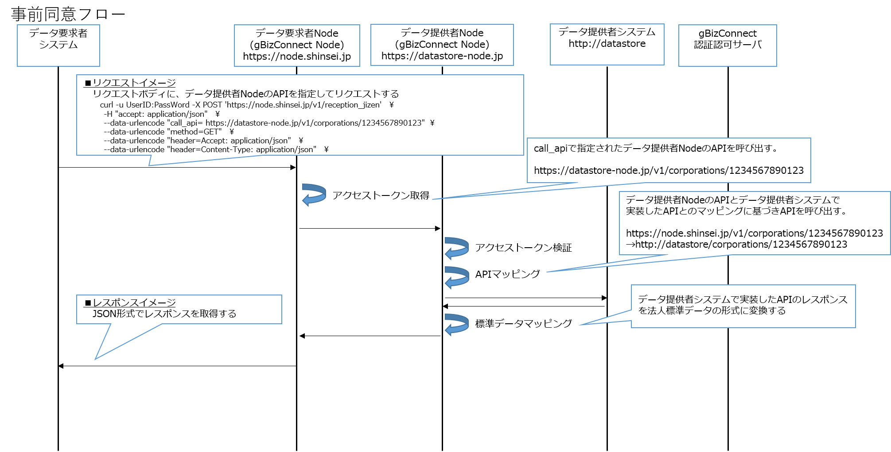

# gBizConnect Node 導入マニュアル  
## はじめに

本マニュアルは、gBizConnect Nodeの導入手順について説明したものです。  
gBizConnect Nodeの仕様については、「[gBizConnect Node仕様書](gBizConnectNode.md)」を参照してください。

ここでは、本マニュアルで共通に使用している用語、表記について説明します。

* ホスト名、ポート番号の表記について  
本マニュアルでは、gBizConnect Nodeを導入するサーバのホスト名は「node.example.jp」と表記します。    
gBizConnect Node導入の際は実際のホスト名に読み替えてください。

 gBizConnect NodeのDockerコンテナの公開ポートのデフォルトは以下の値です。別のポートを使用する場合は読み替えてください。  
|Dockerコンテナ名|公開ポート番号|
|:-|:-|
|edge-module|443|
|config-nginx-php|8080|

 「node.example.jp[:port]」の意味は以下の通りです。  
「node.example.jp」はgBizConnect Nodeを導入するサーバのホスト名です。  
「[:port]」はDockerコンテナedge-moduleの公開ポート番号で443の場合省略可能です。  
指定例：node.example.jp、node.example.jp:443

 法人データストアのAPIのポート番号は「80」で表記します。別のポートを使用する場合は読み替えてください。  


* 用語説明  
「gBizConnect Node設定ファイル」  
gBizConnect Nodeに関する設定をJSON形式で定義したファイルです。  
設定ファイルは、gBizConnect Portalからダウンロードします。  
ダウンロードしたファイルにAPIマッピング、JSON変換等の設定を行い、gBizConnect Node設定画面からファイルを反映します。  

 「njs」  
JavaScript言語の一部で、nginxで使用できます。  

* URL の構成要素に関して  
本マニュアルでは、URL をスキーム名、ホスト名、ポート番号、パスの4つの要素で表記します。

 ```
<スキーム名>://<ホスト名>[:<ポート番号>]<パス>
```

## 1. gBizConnect Portalへのシステム登録  
### 1.1. システム登録  
gBizConnect Nodeから他システムと連携するにはgBizConnect Portalにシステム登録と他システムのAPI利用申請、必要に応じて自身のAPI登録が必要です。詳細は「gBizConnect Portal 利用者向けマニュアル」を参照してください。　　

### 1.2. gBizConnect Node設定ファイルの取得
gBizConnect Nodeを利用するために、gBizConnect PortalでgBizConnect Node設定ファイルをダウンロードしてください。詳細は「gBizConnect Portal 利用者向けマニュアル」を参照してください。  

## 2.	gBizConnect Nodeの導入
### 2.1. gBizConnect Nodeの構成
gBizConnect Nodeは機能を実現するために、Docker Hubに登録されている以下のDockerイメージを使用しています。  

|機能||Dockerイメージ|
|:-|:-|:-|
|データ連携|リクエスト受付API|gbizconnect/gbizconnect-node-nginx:v0.0.1|
||スコープ選択API||
||法人データAPI||
||証明書・通知書等API||
||APIマッピング||
||	JSON変換||
|サービス管理|認証・認可要求||
||ログ記録|gbizconnect/gbizconnect-node-td-agent:v0.0.1|
||API仕様定義|swaggerapi/swagger-editor:v3.7.0|
||API仕様公開|swaggerapi/swagger-ui:v3.24.3|
|||clue/json-server:latest|
||gBizConnect Node設定画面|nginx:1.17.6|
|||php:7.4-rc-fpm-alpine3.10|

### 2.2. gBizConnect Nodeの導入前の準備  
#### 2.2.1. 名前解決の設定  
gBizConnect Nodeを導入するサーバのホスト名は名前解決できるようにDNSを設定してください。

#### 2.2.2. gBizConnect Nodeの動作環境
gBizConnect Nodeを動作させるために、Dockerと必要に応じてDocker Composeが必要です。参考情報として動作確認を行った環境は以下の通りです。

||バージョン|
|:-|:-|
|Docker Server (Engine)|18.09.5|
|Docker Client|18.09.5|
|Docker Compose|1.25.0|
|CentOS|7.6|
|アーキテクチャ|x86_64 / amd64|

### 2.3. Dockerのインストール
以下のURLのOSごとの手順を参照してDockerをインストールしてください。  
https://docs.docker.com/install/  

### 2.4. Docker Composeのインストール
以下のURLのOSごとの手順を参照してDocker Composeをインストールしてください。  
https://docs.docker.com/compose/install/

### 2.5. Dockerコンテナにマウントするディレクトリ・ファイルのダウンロード  
以下のURLからZIPファイルをダウンロードしてください。  
https://github.com/gbizconnect/gbizconnect-node/archive/v0.0.1.zip

### 2.6. Dockerコンテナにマウントするディレクトリ・ファイルの展開
本マニュアルではgBizConnect Nodeのインストールディレクトリを $NODE_HOME=/opt/gbizconnect/gbizconnect-node-0.0.1と表記します。  
gBizConnect Node用のディレクトリを作成し、ダウンロードしたZIPファイルを展開してください。    
```
mkdir /opt/gbizconnect
cd /opt/gbizconnect
# gbizconnect-node-0.0.1.zipをコピー
unzip gbizconnect-node-0.0.1.zip
```

　ZIPファイル展開後のディレクトリは以下の通りです。  
```
/opt/gbizconnect/gbizconnect-node-0.0.1
|-- config-nginx-php
|-- config-php-script
|-- docker-edge-module
|-- docker-td-agent
|-- docs
|-- edge-module
|-- jsonserver
|-- permanent
|-- swaggereditor
|-- swaggerui
|-- td-agent
|-- docker-compose.yml
|-- README.md
```

### 2.7.	Dockerコンテナにマウントするディレクトリ・ファイルの設定  
#### 2.7.1. TLS通信に必要なファイルの設定
TLS通信を使用するため、秘密鍵、サーバ証明書、およびルート証明書を用意してください。  

(1)	秘密鍵、サーバ証明書、およびルート証明書のマウント    
下表の格納するファイルパスに用意したファイルを上書きコピーしてください。

|TLS通信に必要なファイル|格納するファイルパス|
|:-|:-|
|CA（認証局）のルート証明書（PEM形式）|$NODE_HOME/edge-module/nginx/ssl/trusted_ca_cert.crt|
|CA（認証局）が発行したサーバ証明書（PEM形式）|$NODE_HOME/edge-module/nginx/ssl/localhost.pem|
|秘密鍵（PEM形式）|$NODE_HOME/edge-module/nginx/ssl/localhost.key|  

(2)	秘密鍵、サーバ証明書、およびルート証明書の注意事項  
パスフレーズ付きの秘密鍵は使用できません。パスフレーズを解除してから使用してください。  

#### 2.7.2.	Basic認証用のID/PWの設定  
受付APIのBasic認証の設定を以下の手順で行ってください。  
(1) $NODE_HOME/edge-module/nginx/pass_gen.sh に含まれるUSER, PASSWDに任意の値を設定します。  

[設定例]
```
USER=admin
PASSWD=password
```

(2) Basic認証用に使用する".htpasswd"ファイルを、以下のコマンドにより生成します。  
```
cd $NODE_HOME/edge-module/nginx
sh pass_gen.sh
```

#### 2.7.3.	API仕様定義／公開機能のマウントファイルの設定  
ファイルに設定されているホスト名とポート番号を修正します。  
(1)	Swagger Editor  
$NODE_HOME/swaggereditor/index.html の56行目のurlの「node.example.jp[:port]」を実際の値に修正します。
```
url:'https://node.example.jp[:port]/swaggerui/swagger.json',
```

(2) Swagger UI  
$NODE_HOME/swaggerui/swagger.json の7行目のhostの「node.example.jp[:port]」を実際の値に修正します。
```
"host": "node.example.jp[:port]",
```

#### 2.7.4.	ディレクトリ、ファイルの権限  
(1)	ディレクトリ、ファイルの権限を変更  
(ア) 権限の変更コマンドを参考に、権限を変更してください。   

|権限の変更コマンド|
|:-|
|chmod -R 777 $NODE_HOME/config-php-script/log|
|chmod -R 777 $NODE_HOME/permanent|
|chmod -R 777 $NODE_HOME/edge-module/log|
|chmod -R 777 $NODE_HOME/td-agent|
|chmod    644 $NODE_HOME/td-agent/edge/td-agent.conf|  

(イ)	権限が適切に変更されたことを確認してください。  
<コマンド>  
```
ls -l 【対象ファイル、ディレクトリ】
```  
<実行結果例>  
```
-rw-r--r--. [システム部] [対象のファイル名]  
drwxrwxrwx. [システム部] [ディレクトリ名]
```  

[先頭11文字の説明]  
先頭1文字目(d/-): ディレクトリの場合は「d」、ファイルの場合は「-」。  
先頭2～10文字目(r/w/x/-): 変更した権限が、777の場合は「rwxrwxrwx」、644の場合は「rw-r--r--」。

#### 2.7.5.	APIマッピング  
自システムのAPIをgBizConnectで公開する場合は、gBizConnect Node APIと自システムのAPIのマッピングを行います。gBizConnect Nodeは受け付けたリクエストをAPIマッピングにしたがってgBizConnect導入システムのAPIのエンドポイントに変換しリクエストします。  

<設定方法>  
gBizConnect Node設定ファイルの"internal_api_mappings"に、以下の項目の値を設定してください。(複数のAPIマッピングルールを設定できます。)  

|キー|値|
|:-|:-|
|system_api_addr|gBizConnect Node導入システムのAPIのエンドポイントの<スキーム名>://<ホスト名>[:<ポート番号>]部分を記載してください。<スキーム名>はhttpsまたはhttp、<ポート番号>は標準ポート（80, 443）の場合省略可能です。|
|system_api_uri_extract|gBizConnect Node APIのエンドポイントの<パス>を記載してください（njsの正規表現）。|
|system_api_uri_replace|マッピングさせる、gBizConnect Node導入システムのAPIのエンドポイントの<パス>を記載してください（njsの正規表現）。|  

※"system_api_uri_extract"、"system_api_uri_replace"は、設定された値を正規表現とみなします。  
　njsの正規表現を用いて記載してください。

<njsの正規表現について>  
njsは[ECMAScript 5.1](https://nginx.org/en/docs/njs/)に準拠しており、以下のページの正規表現を使用できます。  
http://www.ecma-international.org/ecma-262/5.1/#sec-15.10.1  

記載例  
```json
"internal_api_mappings" : [
    {
        "system_api_addr" : "http://app.datastore.jp",
        "system_api_uri_extract" : "^/v1/corporations/([0-9]+)$",
        "system_api_uri_replace" : "/corporations/$1"
    },
    {
        "system_api_addr" : "http://app.datastore.jp:8080",
        "system_api_uri_extract" : "^/v1/corporations/([0-9]+)/notifications/([0-9]+)$",
        "system_api_uri_replace" : "/corporations/$1/notifications/$2"
    }
]
```

上記記載例のマッピング結果は下記になります。  
　　`https://node.example.jp/v1/corporations/1234567890123`  
　　  -> `http://app.datastore.jp/corporations/1234567890123`

　　`https://node.example.jp/v1/corporations/1234567890123/notifications/1`  
　　-> `http://app.datastore.jp:8080/corporations/1234567890123/notifications/1`

#### 2.7.6.	JSON変換  
JSON変換機能を使用する場合は以下の設定を行います。  

<設定方法>  
* json_convertsの設定  
gBizConnect Node設定ファイルの"json_converts"に、以下の項目の値を設定してください。(複数のJSON変換ルールを設定できます。)

|キー|値|
|:-|:-|
|json_convert_get_flag|導入システムのJSONのキーをgBizConnectの標準法人データJSONのキーに変換する実行有無を記載してください。<br>true：JSON変換あり、false：JSON変換なし|
|json_convert_set_flag|gBizConnectの標準法人データJSONのキーを導入システムのJSONのキーに変換する実行有無を記載してください。<br>true：JSON変換あり、false：JSON変換なし|
|json_convert_uri|gBizConnect Node APIのエンドポイントのパスを記載してください（njsの正規表現）。|
|json_convert_method|gBizConnect Node APIのエンドポイントのメソッドを記載してください。|
|json_convert_rule|JSON変換で実行するルール名を記載してください。json_convert_rulesのキーを一つ指定できます。|  

記載例  
```json
"json_converts":[
    {
        "json_convert_get_flag" : true,
			  "json_convert_set_flag" : false,
			  "json_convert_uri" : "^/v1/corporations$",
			  "json_convert_method" : "GET",
			  "json_convert_rule" : "rule_corporations_list"
		},
		{
			  "json_convert_get_flag" : true,
			  "json_convert_set_flag" : true,
			  "json_convert_uri" : "^/v1/corporations/([0-9]+)$",
			  "json_convert_method" : "PATCH",
			  "json_convert_rule" : "rule_corporations"
		}
]
```


* json_convert_rulesの設定  
gBizConnect Node設定ファイルの"json_convert_rules"に、以下の項目の値を設定してください。

|キー|値|
|:-|:-|
|JSON変換ルール名（手動設定）|キーに任意のユニークな名前を設定します。|
|response|gBizConnectの標準法人データJSONのキーの名称／階層|
|datastore|gBizConnect Node導入システムのAPIのレスポンスのJSONのキーの名称／階層|

記載例  
```json
"json_convert_rules" : {
    "rule_corporations" : [
	      {
		        "response" : "基本.宛先.法人番号",
		        "datastore" : "corporate-number"
	      },
      	{
		        "response" : "基本.宛先.法人名",
		        "datastore" : "corporate-name"
	      },
	      {
		        "response" : "基本.内容.従業員数",
		        "datastore" : "employees.all"
	      },
	      {
		        "response" : "基本.内容.正社員数",
		        "datastore" : "employees.regular"
	      },
	      {
		        "response" : "基本.連絡先.電話番号",
		        "datastore" : "phonenumber"
	      }
    ],
    "rule_corporations_list" : [
        {
            "response" : "基本.宛先.法人番号",
            "datastore" : "corporate-number"
        }
    ]
}
```  

<JSON変換の注意事項>
* "json_convert_rules"に記載したキーのみ出力されます。  
（記載しないキーおよび値は削除となります）  
* JSONの階層を示す場合は、親と子の間にドット(.)を付与して表現してください。  
* 変換前のJSONが配列の場合は、それぞれ変換されます。  

<JSON変換例>   
<div align="center">

</div>  


JSONデータ  
・ PATCHリクエスト前の法人データストアのJSONデータ
```json
{
    "corporate-number" : "1234567891011",
    "corporate-name" : "○○株式会社",
    "employees" : {
        "all" : "500",
        "regular" : "400"
    },
    "phonenumber" : "03-1234-5678"
}
```  

(1) 変換前リクエストJSON: gBizConnectの標準法人データJSON
```json
{
    "基本" : {
        "内容" : {
            "従業員数" : "600"
        }
    }
}
```  

(2) 変換後リクエストJSON: gBizConnect Node導入システムのAPIへのリクエストのJSON  

```json
{
    "employees" : {
        "all" : "600"
    }
}
```

(3) 変換前レスポンスJSON: gBizConnect Node導入システムのAPIからのレスポンスのJSON  
```json
{
    "corporate-number" : "1234567891011",
    "corporate-name" : "○○株式会社",
    "employees" : {
        "all" : "600",
        "regular" : "400"
	},
	"phonenumber" : "03-1234-5678"
}
```  

(4) 変換後レスポンスJSON: gBizConnectの標準法人データJSON  
```json
{
    "基本" : {
        "宛先" : {
            "法人番号" : "1234567891011",
            "法人名" : "○○株式会社"
        },
        "内容" : {
            "従業員数" : "600",
            "正社員数" : "400"
        },
        "連絡先" : {
            "電話番号" : "03-1234-5678"
        }
    }
}
```

・ PATCHリクエスト後の法人データストアのJSONデータ
```json
{
    "corporate-number" : "1234567891011",
    "corporate-name" : "○○株式会社",
    "employees" : {
        "all" : "600",
        "regular" : "400"
    },
    "phonenumber" : "03-1234-5678"
}
```  

#### 2.7.7.	個別同意の設定  
(1)	gBizConnect Node設定ファイル  
個別同意の設定を行う場合は、gBizConnect Portalからダウンロードした設定ファイルを変更する必要があります。
gBizConnect Node設定ファイルの"openid_connect"に、以下の項目の値を設定してください。  

|キー|値|
|:-|:-|
|no_consent_url|同意画面でユーザが同意しなかった場合にリダイレクトさせる導入システムのURL|
|post_authorized_url|同意画面でユーザが同意した場合にリダイレクトさせる導入システムのURL|
|redirect_uri|ホスト名とポート番号を実際の値に修正|

```json
"openid_connect":{
    "no_consent_url" : "https://app.denshi.jp/no_consent",
    "post_authorized_url" : "https://app.denshi.jp/post_authorized",
    "redirect_uri" : "https://node.example.jp[:port]/v1/auth/redirect_uri"
}
```

(2) スコープ選択画面  
$NODE_HOME/edge-module/nginx/html/scope.htmlの22行目、formタグのaction属性のホスト名とポート番号を実際の値に修正します。

```
<form action="https://node.example.jp[:port]/v1/auth" method="GET" name="autogetform">
```

29行目、selectタグ(name:client_id)内optionタグのvalue属性に、gBizConnect Portalで利用申請が承認されたAPIを持つシステムのクライアントID(gBizConnect Node設定ファイルのauthorized_server_listに含まれるclient_id)を指定してください。以下のように記載を行ってください。複数記載可能です。  

```
<select name="client_id">
<option value="yyyyyyyyyyyyy-yyyy-yyyy-yyyyyyyyyyyy">法人データストア(yyyyyyyyyyyyy-yyyy-yyyy-yyyyyyyyyyyy)</option>
```

(3) リダイレクトURIについて  
gBizConnect Portalでのシステム登録後、gBizConnect Portalの管理者がシステム登録の承認時に以下のリダイレクトURIを登録していることが前提になります。  
「https://<システムのgBizConnect Nodeを導入したサーバのドメイン>[:port]/v1/auth/redirect_uri」

#### 2.7.8. edge-module.confの設定
gBizConnect Nodeを動作させるために必要な設定を $NODE_HOME/edge-module/nginx/conf.d/edge-module.conf に行います。  

(1)	名前解決の設定   
gBizConnect Nodeを導入したサーバの/etc/resolv.confに設定されている、nameserverのIPアドレスを、edge-module.conf のresolverディレクティブに設定します。(複数指定する場合はスペースで区切り記載してください。)  
```
# cat /etc/resolv.conf
nameserver XXX.XXX.XXX.XXX
nameserver YYY.YYY.YYY.YYY
```
[edge-module.conf]  
```
resolver XXX.XXX.XXX.XXX YYY.YYY.YYY.YYY ipv6=off;
```

(2)	証明書チェーンの階層の数の設定  
本設定はgBizConnect Node起動後に、以下のような証明書関連のエラーが発生した場合に変更すると解決する場合があります。エラーが発生しない場合は変更の必要はありません。
```
upstream SSL certificate verify error: (20:unable to get local issuer certificate) while SSL handshaking to upstream
```
edge-module.conf のproxy_ssl_verify_depthディレクティブは4箇所、lua_ssl_verify_depthディレクティブは１箇所記載されています。それらの値を増やしてください。  

　[edge-module.conf記載例]
```
proxy_ssl_verify_depth        3;
(中略)
lua_ssl_verify_depth          3;
```

#### 2.7.9.	JSON Server
Swagger UIからAPI試行する際のサーバとしてJSON Serverを使用しています。   
詳細はJSON Serverのサイトを参照してください。  
JSON Serverのサイト：https://github.com/typicode/json-server  

<テストデータ>  
API仕様を公開するSwagger UIからAPIを試行された際にレスポンスするテストデータとして$NODE_HOME/jsonserver/db.jsonにサンプルデータが設定されています。テストデータを追加・変更する場合はdb.jsonを編集してください。  

|サンプルデータのパス|API|
|:-|:-|
|/corporations|法人番号一覧取得|
|/corporations-:corporateNum|法人データ取得|
|/corporations-:corporateNum-notifications|証明書・通知書等番号一覧取得|
|/corporations-:corporateNum-<br>notifications-:notificationNum|証明書・通知書等取得|

<注意事項>  
Swagger UIから証明書・通知書等登録API（POST /corporations/{corporate-number}/notifications）を試行した場合サンプルデータではエラーとなります。  

サンプルデータ抜粋
```
{
  "corporations": [
    "1234567891011","1234567891022","1234567891033"
  ],
  "corporations-1234567891011":
    {
      "基本": {
        "宛先": {
          "法人番号": "1234567891011",
          "法人名": "○○株式会社",
（中略）
    }
  ,
  "corporations-1234567891011-notifications": [
    "12345","12346","12347"
  ],
（中略）
  "corporations-1234567891011-notifications-12345":
    {
      "宛先": {
        "法人番号": "1234567891011",
        "商号又は名称": "○○株式会社",
（途中省略）
    }
}
```

<ルート>  
Swagger UIで試行するAPIのエンドポイントと、JSON Serverのテストデータのパスが異なる場合に、前者のパスを後者に振り替えることができます。  
$NODE_HOME/jsonserver/routes.jsonにサンプルルートが設定されています。テストデータに新しいパスを追加する場合は対応するルートを設定してください。  

サンプルルート
```
{
  "/v1/corporations":"/corporations",
  "/v1/corporations/:corporateNum":"/corporations-:corporateNum",
  "/v1/corporations/:corporateNum/notifications":"/corporations-:corporateNum-notifications",
  "/v1/corporations/:corporateNum/notifications/:notificationNum":"/corporations-:corporateNum-notifications-:notificationNum"
}
```

* 左側（キー）に当てはまるURIが、右側（値）の内容に振り替えられます。  
* コロン(:)から始まる文字列は、変数扱いとなり、左右で同じ内容が設定されます。  

振替の例  
Swagger UIで試行するAPIのエンドポイント
`https://app.datastore.jp/jsonserver/v1/corporations/1234567890123/notifications/1`  
-> 振替後のJSON Serverのエンドポイント  
`https://app.datastore.jp/jsonserver/corporations-1234567890123-notifications-1`


記載に関する詳細は、上記のJSON Serverのサイトの以下の項を参照してください。  
* Add custom routes  

#### 2.7.10.	td-agent.conf（参考情報）
gBizConnect NodeのログをgBizConnect Portalに転送するためにtd-agentを使用しています。  
td-agent.confにはログの転送先となるgBizConnect Portalのtd-agentのhost, portが設定されています。

 [td-agent.conf記載例]  

```
(中略)
<match error.log>
  type forward
  <server>
    host xxx.xxx.xxx.xxx
    port 24233
(中略)
```

### 2.8.Docker Composeコマンドを使用したgBizConnect Nodeの起動  
#### 2.8.1. docker-compose.ymlの修正  
Dockerコンテナを起動する前に、docker-compose.ymlを修正します。  
swaggeruiの項目のAPI_URLに含まれるURLのホスト名とポート番号を実際のホスト名とポート番号に修正します。  

```
swaggerui:
environment:
		-API_URL=https://node.example.jp[:port]/swaggerui/swagger.json
```  
edge-moduleとconfig-nginx-phpの公開ポートを変更する場合は、portsの左側の値を変更してください。

```
edge-module:
    (中略)
    ports:
      - 443:443
   (中略)
  config-nginx-php:
    (中略)
    ports:
      - 8080:8080
```
Docker起動時にポートが重複する場合は、各項目のポートを見直してください。  

#### 2.8.2.	Dockerコンテナの起動  
　gBizConnect Nodeを起動する場合は、以下のコマンドを実行しDockerコンテナを起動します。

```
cd $NODE_HOME
docker-compose up -d
```

#### 2.8.3.	Dockerコンテナの起動確認  
gBizConnect Nodeの起動を確認する場合は、以下のコマンドを実行しDockerコンテナ(config-php-script config-nginx-php swaggereditor swaggerui jsonserver edge-module td-agent)の起動を確認します。
```
cd $NODE_HOME
docker-compose ps
```

#### 2.8.4.	Dockerコンテナの停止
gBizConnect Nodeを停止する場合は、以下のコマンドを実行しDockerコンテナを停止します。  
```
cd $NODE_HOME
docker-compose stop
```

### 2.9.	Dockerコマンドを使用したgBizConnect Nodeの起動  
#### 2.9.1.	Dockerネットワークの作成
gBizConnect Nodeで使用するDockerネットワークを作成するために、以下のコマンドを実行します。
なお、本手順はgBizConnect Nodeの導入時に1回だけ実施します。
```
sudo docker network create edge-network
```

docker networkの詳細は以下のURLを参照してください。  
https://docs.docker.com/engine/reference/commandline/network/


#### 2.9.2.	Dockerコンテナの起動（1回目）  
gBizConnect Nodeを起動（1回目）する場合は、以下のコマンドを実行しDockerコンテナを起動します。  
swaggeruiの項目のAPI_URLに含まれるURLのホスト名とポート番号は実際のホスト名とポート番号に修正してください。

```
NODE_HOME=/opt/gbizconnect/gbizconnect-node-0.0.1

sudo docker run -d --network edge-network --name config-php-script \
    -v $NODE_HOME/config-php-script/html/setting.php:/var/www/html/setting.php \
    -v $NODE_HOME/config-php-script/log/php_error.log:/var/www/html/log/php_error.log \
    -v $NODE_HOME/permanent/config.json:/var/www/html/resources/config.json \
    -w /var/www/myapp \
    php:7.4-rc-fpm-alpine3.10

sudo docker run -d --network edge-network --name config-nginx-php -p 8080:8080 \
    -v $NODE_HOME/config-nginx-php/nginx.conf:/etc/nginx/nginx.conf \
    -v $NODE_HOME/config-nginx-php/conf.d/config.conf:/etc/nginx/conf.d/config.conf \
    nginx:1.17.6

sudo docker run -d --network edge-network --name swaggereditor \
    -v $NODE_HOME/swaggereditor/index.html:/usr/share/nginx/html/index.html \
    swaggerapi/swagger-editor:v3.7.0

sudo docker run -d --network edge-network --name swaggerui \
    -v $NODE_HOME/swaggerui/swagger.json:/usr/share/nginx/html/swagger.json \
    -e API_URL=https://node.example.jp[:port]/swaggerui/swagger.json \
    swaggerapi/swagger-ui:v3.24.3

sudo docker run -d --network edge-network --name jsonserver \
    -v $NODE_HOME/jsonserver/db.json:/data/db.json \
    -v $NODE_HOME/jsonserver/routes.json:/data/routes.json \
    clue/json-server:latest -r routes.json

sudo docker run -d --network edge-network --name edge-module -p 443:443 \
    -v $NODE_HOME/edge-module/nginx/nginx.conf:/etc/nginx/nginx.conf \
    -v $NODE_HOME/edge-module/nginx/conf.d/edge-module.conf:/etc/nginx/conf.d/edge-module.conf \
    -v $NODE_HOME/edge-module/nginx/js/nginx.js:/etc/nginx/js/nginx.js \
    -v $NODE_HOME/permanent/config.json:/etc/nginx/resources/config.json \
    -v $NODE_HOME/edge-module/nginx/ssl/localhost.pem:/etc/nginx/ssl/localhost.pem \
    -v $NODE_HOME/edge-module/nginx/ssl/localhost.key:/etc/nginx/ssl/localhost.key \
    -v $NODE_HOME/edge-module/nginx/ssl/dh2048.pem:/etc/nginx/ssl/dh2048.pem \
    -v $NODE_HOME/edge-module/log:/var/log/nginx/ \
    -v $NODE_HOME/edge-module/nginx/ssl/trusted_ca_cert.crt:/etc/nginx/ssl/trusted_ca_cert.crt \
    -v $NODE_HOME/edge-module/nginx/html:/usr/share/nginx/html \
    -v $NODE_HOME/edge-module/nginx/.htpasswd:/etc/nginx/.htpasswd \
    gbizconnect/gbizconnect-node-nginx:v0.0.1

sudo docker run -d --network edge-network --name td-agent -p 24233:24233/tcp \
    -v $NODE_HOME/edge-module/log:/var/log/nginx \
    -v $NODE_HOME/td-agent/edge/td-agent.conf:/etc/td-agent/td-agent.conf \
    -v $NODE_HOME/config-php-script/log:/var/www/html/log \
    -v $NODE_HOME/td-agent/setting:/var/log/setting \
    -v $NODE_HOME/td-agent/tmp:/var/log/td-agent/tmp \
    --tmpfs /tmp --tmpfs /run -v /sys/fs/cgroup:/sys/fs/cgroup:ro --stop-signal SIGRTMIN+3 \
    gbizconnect/gbizconnect-node-td-agent:v0.0.1 /sbin/init
```  

　docker runの詳細を確認する場合は以下のURLを参照してください。  
　https://docs.docker.com/engine/reference/commandline/run/  

#### 2.9.3.	Dockerコンテナの起動（2回目以降）
gBizConnect Nodeを起動（2回目以降）する場合は、以下のコマンドを実行しDockerコンテナを起動します。  

```
sudo docker start config-php-script config-nginx-php swaggereditor swaggerui jsonserver edge-module td-agent
```

#### 2.9.4.	Dockerコンテナの起動確認  
gBizConnect Nodeの起動を確認する場合は、以下のコマンドを実行しDockerコンテナ(config-php-script config-nginx-php swaggereditor swaggerui jsonserver edge-module td-agent)の起動を確認します。  
```
sudo docker ps
```

#### 2.9.5.	Dockerコンテナの停止
gBizConnect Nodeを停止する場合は、以下のコマンドを実行しDockerコンテナを停止します。  
```
sudo docker stop config-php-script config-nginx-php swaggereditor swaggerui jsonserver edge-module td-agent
```

### 2.10. Dockerコンテナ起動後に必要なgBizConnect Nodeの設定  
#### 2.10.1.	gBizConnect Node設定ファイルの反映  
2.7.5項～2.7.7項にて設定済みのgBizConnect Node設定ファイルをgBizConnect Node設定画面から反映させます。  


<画面>  
 <div align="center">
 

 </div>

<設定方法>  

①	gBizConnect Node設定画面（`http://node.example.jp:8080/setting.php`） をブラウザで開きます。  
②	【1】「参照...」からgBizConnect Node設定ファイルを選択します。  
③	【2】「保存」ボタンを押下すると、参照したファイルの全ての内容がgBizConnect Nodeに反映されます。  


#### 3.	API仕様定義／公開

gBizConnect Node API以外に導入システム独自のAPI仕様をSwagger Editorで定義し、Swagger UIで公開できます。独自APIを公開する場合に本手順を実施してください。  

<画面>  
<div align="center">
  
</div>

①	Swagger Editor（`https://node.example.jp[:port]/swaggereditor/`）をブラウザで開いてください。  
②	Swagger Editorで独自API仕様を追記してください。  
　API仕様の記載方法は、Swaggerのサイトを参照してください。  
・Swaggerのサイト：https://swagger.io/docs/specification/2-0/basic-structure/  
③	Swagger Editorの【1】「File」で「Save as JSON」を選択し、ファイル(swagger.json)をローカルに保存し、同ファイルを以下のディレクトリに格納してください。  
$NODE_HOME/swaggerui/  
④	APIマッピングの設定で、独自APIのマッピングを追加してください。  
「2.7.5 APIマッピング」参照  
⑤	gBizConnect Node設定ファイルの反映を実施してください。  
「2.10.1 gBizConnect Node設定ファイルの反映」参照  
⑥	独自APIをgBizConnect Portalに登録してください。  
詳細は「gBizConnect Portal 利用者向けマニュアル」を参照してください。  

## 4.	母体システムの改修
### 4.1.	法人データ連携基盤を活用した連携のイメージ
法人データ連携基盤を活用したイメージは下図の通りです。
<div align="center">


</div>

### 4.2. 電子申請システム・法人データストアにて必要となる実装機能例
<div align="center">


</div>

<br>
<br>
個別同意フロー
<div align="center">



</div>

<br>
<br>
個別同意フロー（事前同意フローとの差異を黄色吹出に記載）  
<div align="center">


 (gBizConnect Nodeの仕様については、「[gBizConnect Node仕様書](gBizConnectNode.md)」を参照してください。)  
</div>

### 4.3. 環境構成例
環境構成のイメージについては、<a href="img/kankyo_kousei_image.png">gBizConnect Nodeの環境構成（例）</a>を参照してください。


以上
